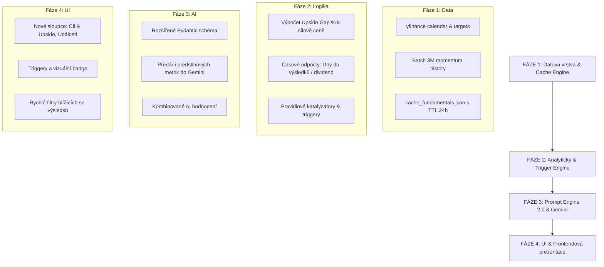
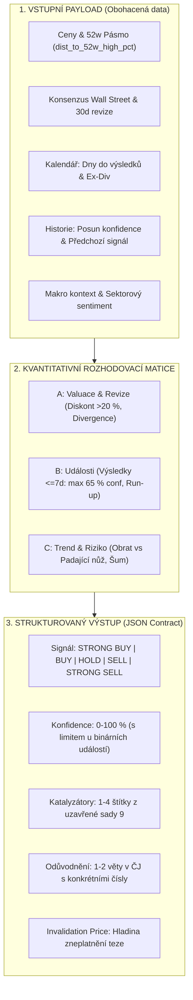

# 🚀 Architektonický implementační plán: Rozšíření SuggestInvest o předstihové indikátory

Tento dokument představuje ucelený architektonický plán na rozšíření systému **SuggestInvest** o **předstihové (forward-looking) indikátory**. Cílem je posunout systém od pouhé reaktivní analýzy včerejších cen a denních změn k prediktivnímu hodnocení postavenému na **analytických konsenzích, firemních kalendářích (hospodářské výsledky, ex-dividendy), časových deltách (1M/3M momentum, vzdálenost od maxim) a automatických triggerech**.

---

## 1. Analýza stávajícího stavu v projektu

V současném řešení probíhá tok dat následovně:
1. **Univerzum ([universe.py](file:///c:/Users/uzivatel/Desktop/SuggestInvest/universe.py))**: 541 unikátních instrumentů rozdělených do tří prioritních košů (`TOP`, `MID`, `LOW`).
2. **Sběr tržních dat ([main.py](file:///c:/Users/uzivatel/Desktop/SuggestInvest/main.py))**:
   - Pomocí `yfinance.Ticker.fast_info` stahuje paralelně: `last_price`, `previous_close`, `year_high`, `year_low`.
   - Vypočítává pouze jednodenní změnu (`change_pct`) a základní heuristický štítek (např. *Silné momentum*, *Test 52w Maxima*).
3. **Prompt Engine & AI ([main.py](file:///c:/Users/uzivatel/Desktop/SuggestInvest/main.py))**:
   - Do modelu `gemini-3.5-flash-lite` posílá dávky po 25 aktivech: symbol, název, aktuální cena, denní změna % a globální RSS zprávy z Yahoo Finance.
   - Model hodnotí aktuální sentiment, ale **nemá žádnou informaci o blížících se hospodářských výsledcích, ex-dividendách ani o cílových cenách analytiků z Wall Street**.
4. **Prezentace ([template.html](file:///c:/Users/uzivatel/Desktop/SuggestInvest/template.html))**:
   - Kompaktní tabulkové řádky s AI kontextem v tooltipu, filtrací a řazením od nejlepších k nejhorším.

---

## 2. Zhodnocení knihoven a technická proveditelnost

Provedli jsme detailní testování vlastností knihovny `yfinance` na různých třídách aktiv (US akcie, evropské akcie, BCPP, ETF a krypto):

### A. Cílové ceny analytiků (Analyst Price Targets)
* **Dostupnost v `yfinance`**: Vlastnost `Ticker.analyst_price_targets` a pole v `Ticker.info` (`targetMeanPrice`, `targetMedianPrice`, `targetHighPrice`, `targetLowPrice`, `numberOfAnalystOpinions`, `recommendationKey`).
* **Výsledky reálného testu**:
  - `NVDA`: Mean target **$327.70** (Upside +46.4 %), 59 analytiků, konsenzus `strong_buy`.
  - `AAPL`: Mean target **$328.22**, 39 analytiků, konsenzus `buy`.
  - `CEZ.PR` (BCPP): Mean target **1 097 CZK**, 12 analytiků.
  - `VWCE.DE` (ETF): Prázdné `{}` (fondy nemají analytické cílové ceny).
* **Rychlost odezvy**: ~0.25–0.35 s na dotaz.

### B. Firemní kalendáře & Časové horizonty (Corporate Calendar & Earnings)
* **Dostupnost v `yfinance`**: Vlastnost `Ticker.calendar`.
* **Výsledky reálného testu**:
  - `NVDA`: `Earnings Date: [2026-11-17]`, `Ex-Dividend Date: 2026-09-10`, odhady tržeb a zisku.
  - `AAPL`: `Earnings Date: [2026-10-29]`, `Ex-Dividend Date: 2026-08-10`.
  - `CEZ.PR`: `Earnings Date: [2026-11-12]`, `Ex-Dividend Date: 2026-06-04`.
* **Časové delty (Countdown)**:
  - Snadný výpočet: `days_to_earnings = (earnings_date - today).days`.
  - Umožňuje okamžitou detekci událostí typu: *"Výsledky za 8 dní"* nebo *"Ex-Dividenda za 3 dny"*.

### C. Trendy a časové delty hybnosti (Momentum Deltas: 1M, 3M, 52w)
* **Dostupnost v `yfinance`**:
  - Metoda `yf.download(tickers_list, period="3mo")` dokáže v **jediném síťovém volání (< 1 sekunda)** stáhnout 3měsíční historii pro desítky tickerů najednou.
  - Vlastnost `fast_info` přímo obsahuje: `fifty_day_average` (SMA50), `two_hundred_day_average` (SMA200) a `year_change`.
* **Přínos**: Okamžité vyhodnocení, zda se titul nachází v dlouhodobém uptrendu (`cena > SMA50 > SMA200`), zda zrychluje 1M momentum vůči 3M průměru a jak daleko je od 52týdenního maxima.

### D. Úskalí a nutná optimalizace (Rate-limiting & Caching)
* **Riziko**: Pokud bychom pro 541 aktiv volali pro každé aktivum samostatně `t.calendar` a `t.analyst_price_targets`, znamenalo by to přes 1 000 HTTP požadavků. To by sken prodloužilo a hrozil by dočasný rate-limit ze strany Yahoo Finance.
* **Architektonické řešení**:
  1. **Inteligentní mezipaměť (`cache_fundamentals.json`) s TTL 24–48 hodin**: Cílové ceny analytiků a kalendář výsledků se nemění v řádu minut ani hodin. Data se stáhnou jednou denně a ukládají do lokální mezipaměti. Běžný sken pak trvá jen sekundy.
  2. **Diferenciace aktiv**: Kalendáře a cílové ceny se dotazují pouze pro akcie (`AKCIE`). Pro ETF a krypto se tyto dotazy zcela přeskakují.
  3. **Dávkové stažení historie**: Pomocí jednoho hromadného volání `yf.download` pro výpočet 1M a 3M delt.

---

## 3. Čtyřfázový plán implementace



---

### 🔹 FÁZE 1: Datová vrstva & Caching Engine (Data Pipeline)
**Cíl:** Získat předstihová data spolehlivě, bleskově a bez rizika blokace ze strany Yahoo Finance.

1. **Vytvoření modulu `fundamentals_fetcher.py`**:
   - Funkce pro bezpečné stažení:
     - `target_mean`, `target_high`, `target_low`, `analysts_count` (cílové ceny a konsenzus).
     - `next_earnings_date`, `days_to_earnings` (datum a počet dní do výsledků).
     - `ex_dividend_date`, `days_to_ex_div` (datum a dny do rozhodného dne).
   - Implementace lokální mezipaměti `cache_fundamentals.json`:
     - Každý záznam nese časové razítko stažení.
     - Pokud je záznam mladší než 24 hodin, použije se okamžitě z disku bez síťového dotazu.
     - Pokud vypršel nebo chybí, dotáže se Yahoo Finance a cache se aktualizuje.
2. **Dávkový výpočet technických delt**:
   - Obohacení `_fetch_single_ticker_data` o hodnoty z `fast_info`:
     - Odchylka ceny od SMA50 v % (`(price - sma50) / sma50 * 100`).
     - Pozice v 52týdenním pásmu (0–100 % mezi Year Low a Year High).
   - Hromadné stažení 1M a 3M cen přes `yf.download` pro určení střednědobého momentu.
3. **Ošetření výjimek a fallbacků**:
   - ETF fondy a Krypto: automaticky nastaveny hodnoty `N/A` pro earnings a cílové ceny bez zbytečných dotazů.

---

### 🔹 FÁZE 2: Analytický & Pravidlový Trigger Engine (Rule-based Evaluator)
**Cíl:** Zformovat z hrubých dat přesné kvantitativní indikátory a automatické triggery ještě před zapojením AI.

1. **Metrika: Upside / Downside Gap k cílové ceně**:
   $$\text{Target Upside \%} = \frac{\text{Target Mean Price} - \text{Current Price}}{\text{Current Price}} \times 100$$
   - Kategorizace:
     - 🟢 *Vysoký diskont* (Upside > +20 % při $\ge 5$ analytických doporučeních).
     - 🟡 *Férové ocenění* (-5 % až +15 %).
     - 🔴 *Vyčerpaný potenciál / Nadhodnoceno* (Cena je nad Target Mean, tj. Upside < 0 %).
2. **Metrika: Časový odpočet a kalendářní triggery**:
   - ⏳ **Earnings Alert**:
     - *Kritický*: Výsledky za 1–7 dní (vysoká implikovaná volatilita, opatrnost před otevřením nové pozice).
     - *Blížící se*: Výsledky za 8–21 dní (období earnings runupu).
   - 💰 **Dividend Capture**:
     - Ex-dividenda za 1–14 dní (atraktivní pro výnosové investory).
3. **Metrika: Trend & Momentum Akcelerace**:
   - 🚀 **Technický průraz (Golden Momentum)**: Cena > SMA50 > SMA200 a 1M delta > +5 %.
   - ⚠️ **Korekční tlak**: Cena < SMA50 a pokles od 52w Maxima > 15 %.
4. **Výstup fáze**: Každé aktivum obdrží normalizovaný seznam aktivních triggerů (např. `["EARNINGS_SOON", "ANALYST_DISCOUNT_35"]`), které slouží jak pro frontend, tak pro prompt engine.

---

### 🔹 FÁZE 3: Prompt Engine 2.0 & Gemini Evaluace
**Cíl:** Dát AI modelu kompletní kontext o budoucích událostech a konsenzu Wall Street pro tvorbu špičkových analýz.

1. **Rozšíření Pydantic schématu v `main.py`**:
   ```python
   class TickerSignalItem(BaseModel):
       ticker: str
       signal: str  # Strong Buy, Buy, Hold, Sell, Strong Sell
       probability: int
       impact_direction: str  # up, down
       target_price_consensus: Optional[float] = Field(description="Konsenzuální cílová cena analytiků")
       target_upside_pct: Optional[float] = Field(description="Očekávaný procentuální zisk k cíli")
       time_horizon: str = Field(description="Doporučený horizont: '1-4 týdny' (před earnings) nebo '3-6 měsíců'")
       catalyst_event: Optional[str] = Field(description="Nejbližší klíčový spouštěč (např. Výsledky za 12 dní)")
       reasoning: str = Field(description="Syntéza technických, kalendářních a fundamentálních faktorů v češtině.")
   ```
2. **Aktualizace systémové instrukce pro Gemini**:
   - Model bude přímo instruován:
     - *„Zohledni vztah aktuální ceny k cílové ceně analytiků (např. má-li titul 35% diskont k cíli a silné momentum, jedná se o silný nákupní argument).“*
     - *„Upozorni na blížící se hospodářské výsledky (pokud jsou za méně než 14 dní), kde hrozí skoková volatilita.“*
     - *„Propoj fundamentální očekávání s aktuálním globálním tržním sentimentem z RSS zpráv.“*
3. **Kompaktní prompt payload**:
   - Efektivní formátování dat do JSONu tak, aby se 25 aktiv vešlo do optimálního token limitu a odezva byla do 2 sekund na dávku.

---

### 🔹 FÁZE 4: UI & Frontendová prezentace (template.html)
**Cíl:** Prezentovat předstihové indikátory přehledně, moderně a s okamžitou informační hodnotou pro investora.

1. **Nové sloupce a vizuální prvky v tabulkovém řádku**:
   - **Cílová cena & Potenciál (Target & Upside)**:
     - Zobrazení cílové ceny v měně aktiva (např. `327.70 USD`).
     - Barevná pilulka s procentuálním potenciálem: `+46.4 %` (zelená) nebo `-5.2 %` (červená).
     - Informace o počtu analytiků (např. `59 analytiků`).
   - **Kalendář událostí (Corporate Events)**:
     - Badge s odpočtem: ⏳ `Výsledky za 12 dní (17. 11.)` nebo 💰 `Ex-div za 5 dní`.
   - **Dlouhodobý trend (Trend & Delty)**:
     - Kompaktní indikátor 1M a 3M výkonnosti přímo u ceny.
2. **Rozšíření AI Tooltipu (`💡 Kontext`)**:
   - Do bubliny při najetí myší přibude sekce **Předstihové ukazatele**:
     - *Konsenzus Wall Street:* Cílové rozpětí (Min: $180 | Průměr: $328 | Max: $515).
     - *Hospodářský kalendář:* Přesný datum kvartálních výsledků a konsenzuální odhad EPS/tržeb.
     - *Doporučený investiční horizont.*
3. **Nové interaktivní filtry v hlavičce**:
   - Filtr podle triggerů:
     - `🎯 Vysoký diskont (> 20 %)`
     - `⏳ Výsledky do 14 dnů`
     - `💰 Blížící se dividenda`
     - `📈 Silný trend (nad SMA50)`
4. **Aktualizace metodického dokumentu**:
   - Doplnění nové kapitoly do `Analyza_Dat_a_Metodika_SuggestInvest.docx` s vysvětlením metodiky výpočtu předstihových indikátorů a práce s cílovými cenami.

---

### 🔹 FÁZE 5: Historická persistence & Audit log (Data Lake & SQLite Time-Series)
**Cíl:** Dlouhodobé uchovávání všech provedených skenů, tržních vstupů i predikcí AI pro účely auditu, sledování vývoje sentimentu a automatického backtestingu.

1. **Architektura ukládání ve 2 úrovních**:
   - **Úroveň A: Neměnný denní JSON Data Lake (`data/history/YYYY-MM-DD.json`)**: Uložení kompletního surového snapshotu všech aktiv, jejich technických hodnot, předstihových ukazatelů a plných AI odůvodnění v neměnném formátu.
   - **Úroveň B: SQLite Časová řada (`data/history/history.db`)**: Relační databáze se schématem `scans` a `signal_history` s B-Tree indexy pro rychlé dotazování a backtesting.
2. **Automatizace v CI/CD**: Workflow GitHub Actions ([market_cron.yml](file:///c:/Users/uzivatel/Desktop/SuggestInvest/.github/workflows/market_cron.yml)) denně v 7:50 archivuje JSON snapshoty a SQLite záznamy přímo do repozitáře.

---

### 🔹 FÁZE 6: Institucionální Kvantitativní Model & Head of Risk Framework (Senior Quant Decision Engine)
**Cíl:** Povýšit systém z popisného screeningu na institucionální úroveň investičního fondu s formální rozhodovací maticí, přesným JSON kontraktem, asymetrickým risk-reward poměrem a validací stop-loss úrovní (invalidation price).



#### 1. Datový Payload pro každé aktivum
Strukturovaný JSON payload předávaný modelu pro každé aktivum z univerza:
```json
{
  "ticker": "NVDA.US",
  "name": "NVIDIA Corporation",
  "tier": "TIER 1",
  "sector": "Semiconductors",
  "price": {
    "current": 128.5,
    "currency": "USD",
    "change_1d_pct": +1.2,
    "change_1m_pct": +14.2,
    "change_3m_pct": +28.6,
    "high_52w": 140.7,
    "low_52w": 45.0,
    "dist_to_52w_high_pct": 91.3
  },
  "consensus": {
    "target_mean": 155.0,
    "target_high": 200.0,
    "target_low": 90.0,
    "analyst_count": 42,
    "target_upside_pct": +20.6,
    "delta_target_30d_pct": +5.8
  },
  "calendar": {
    "days_to_earnings": 19,
    "earnings_time": "AMC",
    "days_to_ex_dividend": null
  },
  "history": {
    "prev_signal": "BUY",
    "prev_confidence": 80,
    "confidence_delta_7d": +4
  },
  "macro_context": "Big Tech navyšuje kapitálové výdaje do AI čipů..."
}
```

#### 2. Deterministická Rozhodovací Matice a Event Triggery
- **A. Triggery konsenzu a valuace**:
  - *Fundamentální diskont (Target Upside > +20 %)*: Počet analytiků $\ge 5$ a $\Delta$ target 30d $\ge 0$ $\rightarrow$ silný růstový signál (`BUY` / `STRONG BUY`).
  - *Pozitivní divergence*: Cena klesá (1M $< 0$), ale cílová cena roste ($\Delta$ target 30d $> 0$) $\rightarrow$ institucionální akumulace.
  - *Přepálená valuace*: Pokud je target upside $\le 0$, růstový potenciál je vyčerpán $\rightarrow$ zákaz `BUY`/`STRONG BUY`, striktně `HOLD` nebo `SELL`.
- **B. Událostní filtry kalendáře**:
  - *Kritické okno před výsledky (dny $\le 7$)*: Implikovaná volatilita roste, binární riziko. `confidence` nesmí překročit 65 % (výjimka: defenzivní monopol). Štítek: `⏳ Výsledky do 7 dní`.
  - *Předvýsledkový run-up (dny 8–21)*: 1M $> 0$ a $\Delta$ target 30d $> 0$ $\rightarrow$ akumulační fáze před výsledky. Štítek: `📅 Výsledky do 21 dní`.
  - *Dividendový trigger (dny $\le 14$)*: Vhodné pro akumulaci pozice před nárokem na dividendu. Štítek: `💰 Ex-Div za N dní`.
- **C. Filtry trendu a spolehlivosti**:
  - *Obrat vs. Padající nůž*: Test 52w minima (`dist_to_52w_high_pct` $< 70$) s klesající cílovou cenou ($\Delta$ target 30d $< -5$) $\rightarrow$ `SELL` nebo `STRONG SELL`. Test 52w minima se stabilní cílovou cenou a rostoucím 1M momentem $\rightarrow$ `BUY`.
  - *Kontrola šumu*: Denní skok $> \pm 3\,\%$ ignorovat, pokud není v souladu s 1M momentem nebo novou fundamentální zprávou.

#### 3. Striktní JSON výstupní kontrakt (Strict JSON Contract)
Každé vyhodnocené aktivum generuje strukturovaný výstup:
```json
{
  "ticker": "NVDA.US",
  "signal": "STRONG BUY",
  "confidence": 84,
  "impact_direction": "▲ Růst",
  "catalysts": [
    "🚀 Silné momentum",
    "🎯 Vysoký diskont",
    "📅 Výsledky do 21 dní"
  ],
  "reasoning": "Konsenzuální cílová cena vzrostla za posledních 30 dní o 5,8 % na 155 USD, což při 20% diskontu a 19 dnech do výsledků podporuje pokračování předvýsledkového run-upu. Pozice těží ze stabilního zrychlování kapitálových výdajů v celém AI sektoru.",
  "invalidation_price": 116.0
}
```

**Pravidla a taxonomie výstupu**:
1. `signal`: Striktně 5 úrovní: `STRONG BUY`, `BUY`, `HOLD`, `SELL`, `STRONG SELL`.
2. `confidence`: Celé číslo 0 až 100.
3. `impact_direction`: Striktně `"▲ Růst"` nebo `"▼ Pokles"`.
4. `catalysts`: Výběr 1 až 4 štítků z přesné uzavřené množiny 9:
   - `🚀 Silné momentum` (denní pohyb $> +3\,\%$ nebo 1M $> +10\,\%$)
   - `📉 Přeprodáno / Korekce` (pokles $> -3\,\%$ v býčím trendu)
   - `🔥 Test 52w Maxima` (cena $\ge 97\,\%$ z ročního maxima)
   - `🎯 Vysoký diskont` (potenciál k cíli $> +20\,\%$ při $\ge 5$ analytících)
   - `⚠️ Nad cílem analytiků` (aktuální cena překročila průměrný cíl)
   - `⏳ Výsledky do 7 dní` (hrozba skokové volatility)
   - `📅 Výsledky do 21 dní` (fáze předvýsledkového run-upu)
   - `💰 Ex-Div za N dní` (blížící se rozhodný den pro dividendu)
   - `🇨🇿 BCPP Dividendy` (pro české tituly s vysokým výnosem)
5. `reasoning`: Přesně 1 až 2 věty v češtině. Musí explicitně obsahovat vztah kurzu, cílové ceny a blížící se události. Zákaz vágních frází.
6. `invalidation_price`: Konkrétní číselná hladina (stop-loss úroveň), při jejímž prolomení celá investiční teze zaniká.

---

## 4. Přehled fází a stav realizace

| Fáze | Popis | Stav | Priorita |
| :--- | :--- | :--- | :--- |
| **Fáze 1** | Datová vrstva, mezipaměť `cache_fundamentals.json`, dávkové delty | ✅ Dokončeno | - |
| **Fáze 2** | Výpočetní logika triggerů, gapů a kalendářních odpočtů | ✅ Dokončeno | - |
| **Fáze 3** | Prompt Engine 2.0, Pydantic schéma, nové instrukce Gemini | ✅ Dokončeno | - |
| **Fáze 4** | Rozšíření tabulky v `template.html`, tooltipy, filtry triggerů | ✅ Dokončeno | - |
| **Fáze 5** | Historická persistence (JSON snapshoty + SQLite `history.db`) | ✅ Dokončeno | - |
| **Fáze 6.1** | Obohacení datového payloadu (`dist_to_52w_high_pct`, `delta_target_30d_pct`, historie) | 🚀 K realizaci | Nejvyšší |
| **Fáze 6.2** | Pydantic kontrakt & Gemini Prompt s Quant & Risk Personou a pravidly | 🚀 K realizaci | Nejvyšší |
| **Fáze 6.3** | Harmonizace Trigger Engine a Deterministického Fallbacku (9 štítků) | 🚀 K realizaci | Vysoká |
| **Fáze 6.4** | UI prezentace (5stupňové signály, multi-catalysts, Invalidation Price) | 🚀 K realizaci | Vysoká |
| **Fáze 6.5** | Migrace SQLite schématu (`invalidation_price`, `catalysts`) a persistence | 🚀 K realizaci | Vysoká |
| **Fáze 6.6** | Aktualizace Word metodiky (`create_methodology_doc.py`) | 🚀 K realizaci | Střední |

---

## 5. Podrobný akční plán realizace Fáze 6 (Krok za krokem)

### Krok 1: Obohacení datového modelu a payloadu
- V [history_manager.py](file:///c:/Users/uzivatel/Desktop/SuggestInvest/history_manager.py) vytvořit funkci `get_ticker_historical_context(yahoo_symbol, current_target_mean)`:
  - Zjistí předchozí signál (`prev_signal`), předchozí konfidenci (`prev_confidence`) a spočítá týdenní posun `confidence_delta_7d`.
  - Vyhledá cílovou cenu z doby před 30 dny a spočítá `delta_target_30d_pct`.
- V [main.py](file:///c:/Users/uzivatel/Desktop/SuggestInvest/main.py) při přípravě promptu vytvořit přesný objekt `price` s `dist_to_52w_high_pct = round((price / year_high) * 100, 1)`, `consensus` objekt, `calendar` objekt s `earnings_time`, `history` objekt a `macro_context` (odvozený ze sektorových charakteristik a RSS feedu).

### Krok 2: Pydantic schémata a systémový prompt v `main.py`
- Upravit Pydantic třídu `TickerSignalItem`:
  ```python
  class TickerSignalItem(BaseModel):
      ticker: str
      signal: Literal["STRONG BUY", "BUY", "HOLD", "SELL", "STRONG SELL"]
      confidence: int = Field(ge=0, le=100)
      impact_direction: Literal["▲ Růst", "▼ Pokles"]
      catalysts: List[str]
      reasoning: str
      invalidation_price: Optional[float] = None
  ```
- Přepsat `system_instruction` v `_call_gemini_batch`:
  - Kompletní začlenění persony: *Senior Quantitative Equity Analyst a Head of Portfolio Risk v investičním labu SuggestInvest*.
  - Pravidla A (Konsenzus a valuace), B (Kalendář a limity konfidence), C (Trend a šum).
  - Přesná množina 9 povolených štítků.
  - Pravidlo pro přesně 1 až 2 věty odůvodnění s konkrétními hodnotami.
  - Vzorový Few-Shot příklad (`NVDA.US`).

### Krok 3: Harmonizace a validace v `trigger_engine.py`
- Aktualizovat generované štítky v `trigger_engine.py` tak, aby 100% odpovídaly přesné sadě 9 oficiálních štítků.
- Doplnit pravidlovou kalkulaci doporučené `invalidation_price`:
  - Pro BUY / STRONG BUY: např. nedávné lokální minimum / SMA50 nebo 90-92 % aktuální ceny.
  - Pro SELL / STRONG SELL: rezistence / 52w maximum nebo 108 % aktuální ceny.
- Zpřesnit fallback generátor (`generate_mock_signals_for_universe`), aby generoval signály v nové 5stupňové škále (`STRONG BUY` až `STRONG SELL`) se striktním dodržením všech pravidel.

### Krok 4: Aktualizace databáze a ukládání historie v `history_manager.py`
- Přidat do tabulky `signal_history` sloupce:
  - `invalidation_price REAL`
  - `catalysts TEXT` (JSON pole štítků)
  - `confidence INTEGER`
- Upravit vkládací SQL dotaz a obsluhu `save_scan_history`.

### Krok 5: UI & Frontendová prezentace v `template.html`
- Styly pro 5 úrovní signálů:
  - `STRONG BUY`: sytý smaragdový gradient s bílým textem.
  - `BUY`: svěží zelená.
  - `HOLD`: jantarová / žluto-oranžová.
  - `SELL`: červená.
  - `STRONG SELL`: sytý rubínový gradient.
- Zobrazení `catalysts` jako multi-tag pole čipů pod názvem aktiva.
- Zobrazení **Invalidation Price (Stop)**:
  - Nový vizuální prvek u cílové ceny: `🛑 Stop: 116.0 USD` s odstupem v %.
- Aktualizace rychlých filtrů:
  - Filtry: `Vše`, `STRONG BUY`, `BUY`, `HOLD`, `SELL & STRONG SELL`, `🎯 Vysoký diskont`, `⏳ Výsledky do 7 dní`, `📅 Výsledky do 21 dní`, `💰 Ex-Div za N dní`.

### Krok 6: Aktualizace Word dokumentu Metodika
- Skript [create_methodology_doc.py](file:///c:/Users/uzivatel/Desktop/SuggestInvest/create_methodology_doc.py):
  - Přidat podkapitolu o Kvantitativní rozhodovací matici Senior Quant & Risk Engine.
  - Dokumentovat 5 úrovní signálů a jejich asymetrický profil výnosu a rizika.
  - Zaznamenat definici invalidačních cen (invalidation price / stop-loss hladin).
  - Zdokumentovat uzavřenou množinu 9 schválených štítků katalyzátorů.
- Znovu vygenerovat `Analyza_Dat_a_Metodika_SuggestInvest.docx`.

---

## Fáze 7: Kvantitativní Analýza Dividendových Anomálií (Ex-Date Recovery Velocity & Drop-Off Ratio)

### Koncepční cíl
Vyhodnotit pro všechny dividendové tituly s blížícím se Ex-Date ($\le 45$ dní) a české dividendové stálice BCPP historický profil posledních 4 až 8 výplat dividend a poskytnout investorovi exaktní doporučení podložené daty:
1. **`🟢 DRŽET PŘES EX-DIV (CAPTURE)`**: Kurz historicky v $\ge 65\ \%$ případů rychle smaže dividendový gap (do 15 dní, medián $\le 15$ dní). Doporučeno držet přes Ex-Date a inkasovat dividendu.
2. **`🟡 PRODAT PŘED EX-DIV (HARVEST)`**: Předexový růst (20d run-up) dosahuje alespoň $1.5\ \%$ a převyšuje dividendový výnos, ale zotavení po Ex-Date je pomalé ($\le 40\ \%$ do 15 dní). Doporučeno realizovat zisk před Ex-Date bez srážkové daně.
3. **`⚪ BĚŽNÝ PRŮBĚH (NEUTRÁLNÍ)`**: Žádná statistická anomálie.

### Implementované komponenty
- **Modul `dividend_analyzer.py`**:
  - `analyze_ticker_dividend_history(symbol, max_events=6)`
  - Výpočet $DDR$ (Dividend Drop-Off Ratio), $T_{rec}$ (Recovery Velocity do 15 a 30 dní, medián), 20denního pre-ex run-upu.
  - Lokální 7denní mezipaměť v `data/dividend_cache.json`.
- **Integrace do `trigger_engine.py`**:
  - Spouštění analýzy pro tituly s Ex-Div $\le 45$ dní a BCPP akcie v CZK.
  - Nové triggery: `CAT_DIV_CAPTURE` a `CAT_DIV_HARVEST`.
  - Začlenění do forward-looking AI kontextu.
- **Rozšíření promptu a modelu v `main.py`**:
  - Předávání `calendar.dividend_strategy` modelu Gemini.
  - Mapování `dividend_analysis` do datových karet pro frontend.
- **Frontend & Tooltip v `template.html`**:
  - Dedikovaný box v tooltipu `💡 Kontext`: *💰 Ex-Div Taktika & Historické Zotavení* s mírou zotavení, mediánem dní, run-upem a zdůvodněním.
- **Metodika v `create_methodology_doc.py`**:
  - Nová kapitola *6.8 Kvantitativní Analýza Dividendových Anomálií (Ex-Date Recovery Velocity)* ve vygenerovaném `Analyza_Dat_a_Metodika_SuggestInvest.docx`.

---

## Fáze 8: Denní sledování změn a detekce tržních obratů (Daily Delta & Change Tracker)

### Koncepční cíl
Automaticky sledovat mezidenní posuny v hodnocení 541 sledovaných aktiv. Identifikovat a vizuálně zvýraznit tituly, u kterých došlo ke změně doporučení (rating upgrade/downgrade), skokovému posunu míry jistoty ($\Delta \text{Confidence} \ge \pm 10\%$), zásadní revizi cílové ceny analytiků ($\ge \pm 8\%$) nebo aktivaci nových předstihových katalyzátorů.

### Implementované komponenty
- **Modul `history_manager.py`**:
  - Implementována funkce `compute_daily_changes(cards, current_scan_id, current_scan_date)`:
    - Vyhledává předchozí referenční sken v SQLite databázi `history.db` (primárně z předchozího data, záložně nejnovější předcházející sken).
    - Porovnává 5stupňové pořadí signálů (`STRONG BUY` = 5, `BUY` = 4, `HOLD` = 3, `SELL` = 2, `STRONG SELL` = 1).
    - Klasifikuje typ změny: `UPGRADE`, `DOWNGRADE`, `CONFIDENCE_JUMP`, `CONFIDENCE_DROP`, `TARGET_SHIFT`, `NEW_CATALYST`, `NEW_ASSET`, `UNCHANGED`.
    - Generuje srozumitelný český popis do tooltipu a barevný odznak pro tabulku.
    - Vrací globální statistiky: celkový počet změn, počet upgradů, downgradů a skoků konfidence.
- **Integrace v `main.py`**:
  - Volání `compute_daily_changes` po setřídění karet a před vygenerováním `index.html`.
  - Předávání statistik změn do `build_html_report(..., change_stats=change_stats)`.
  - Ukládání statistik změn do `scan_meta["counts"]` při zápisu do databáze.
- **Frontend & Uživatelské rozhraní v `template.html`**:
  - **Meta-bar**: Nový ukazatel `⚡ Změny od včerejška: N (⬆️ U | ⬇️ D)`.
  - **Filtrační panel**: 6. skupina filtrů `⚡ Posuny od včerejška` s tlačítky `Všechny tituly`, `⚡ Všechny změny (N)`, `⬆️ Upgrady (U)`, `⬇️ Downgrady (D)`, `🔥 Změna konfidence (C)`.
  - **Tabulka aktiv (Řádek)**: Datové atributy `data-changed` a `data-change-type`.
  - **Sloupec AI Signál**: Výrazný mikroodznak (např. `⬆️ UPGRADE`, `⬇️ DOWNGRADE`, `⚡ +12% CONF`, `🔥 KATALYZÁTOR`).
  - **AI Tooltip (💡 Kontext)**: Prominentní srovnávací blok na prvním místě tooltipu s popisem důvodu posunu, předchozím a novým hodnocením i vizuálním tokem `HOLD (65 %) ➜ BUY (82 %)`.
  - **JavaScript**: Dynamické filtrování v `applyFilters()` reagující na výběr filtru změn.
- **Metodika v `create_methodology_doc.py`**:
  - Přidána kapitola *6.9 Denní sledování změn a detekce tržních obratů (Daily Delta & Change Tracker)*.
  - Znovu zkompilován a aktualizován soubor `Analyza_Dat_a_Metodika_SuggestInvest.docx`.

---

## Fáze 9: Spouštění skenu na vyžádání v cloudu (On-Demand Cloud Scan Trigger)

### Koncepční cíl
Umožnit uživateli kdykoliv z webového rozhraní (i mimo automatické ranní hodiny cronu) spustit čerstvý přepočet trhů a Gemini AI analýzu pro všech 541 sledovaných aktiv.

### Implementované komponenty
- **Frontend & Tlačítko v `template.html` / `index.html`**:
  - Tlačítko `⚡ Spustit sken v cloudu` (`#triggerScanBtn`) s pulzujícím/jantarovým vizuálem a stavem načítání.
  - Tlačítko nastavení tokenu `⚙️` (`#tokenConfigBtn`) pro snadnou správu/vymazání uloženého klíče.
  - Tlačítko `Obnovit data` (`#refreshBtn`) zachováno pro rychlé vyčištění mezipaměti prohlížeče a stažení již publikovaného reportu.
- **Bezpečnostní dialog (`#tokenModal`)**:
  - Glassmorphic modal pro bezpečné zadání GitHub Personal Access Tokenu (PAT) s právem `Actions: Read and write`.
  - Token se ukládá výhradně do lokální paměti prohlížeče klienta (`localStorage`), nikdy neopouští prohlížeč a posílá se pouze na oficiální `api.github.com`.
  - Přímý odkaz na generování tokenu v GitHub nastavení.
- **Komunikace s GitHub API & Živý monitoring běhu**:
  - Vyvolání eventu `POST /repos/OndrejVas/SuggestInvest/actions/workflows/market_cron.yml/dispatches`.
  - Automatické dotazování (polling) stavu workflow každých 10 s (`queued` ➔ `in_progress` ➔ `completed`).
  - Živý časovač běhu a přímý proklik na běžící log na GitHubu (`Sledovat živý log na GitHubu ↗`).
  - Po úspěšném dokončení automatický reload stránky s cache-busting parametrem.

