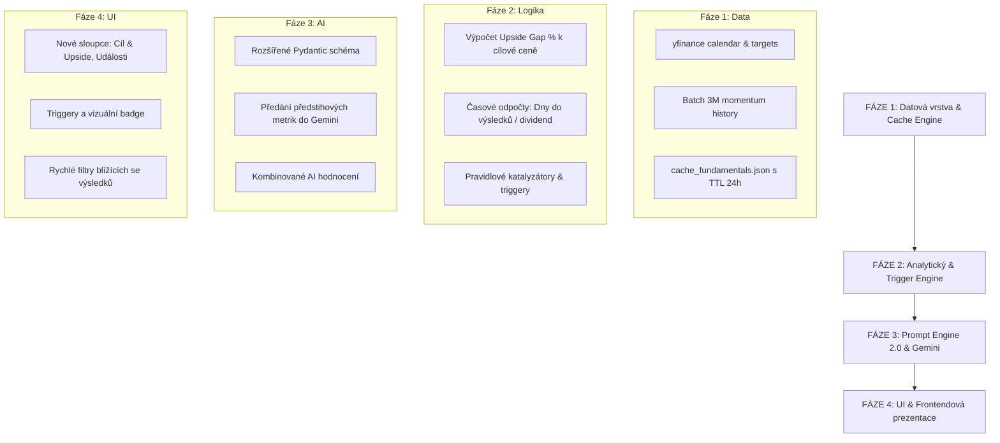

# 🚀 Architektonický implementační plán: Rozšíření SuggestInvest o předstihové indikátory

Tento dokument představuje ucelený architektonický plán na rozšíření systému **SuggestInvest** o **předstihové (forward-looking) indikátory**. Cílem je posunout systém od pouhé reaktivní analýzy včerejších cen a denních změn k prediktivnímu hodnocení postavenému na **analytických konsenzích, firemních kalendářích (hospodářské výsledky, ex-dividendy), časových deltách (1M/3M momentum, vzdálenost od maxim) a automatických triggerech**.

---

## 1. Analýza stávajícího stavu v projektu

V současném řešení probíhá tok dat následovně:
1. **Univerzum ([universe.py](file:///c:/Users/uzivatel/Desktop/SuggestInvest/universe.py))**: 541 unikátních instrumentů rozdělených do tří prioritních košů (`TOP`, `MID`, `LOW`).
2. **Sběr tržních dat ([main.py](file:///c:/Users/uzivatel/Desktop/SuggestInvest/main.py))**:
   - Pomocí `yfinance.Ticker.fast_info` stahuje paralelně: `last_price`, `previous_close`, `year_high`, `year_low`.
   - Vypočítává pouze jednodenní změnu (`change_pct`) a základní heuristický štítek (např. *Silné momentum*, *Test 52w Maxima*).
3. **Prompt Engine & AI ([main.py](file:///c:/Users/uzivatel/Desktop/SuggestInvest/main.py))**:
   - Do modelu `gemini-3.5-flash-lite` posílá dávky po 25 aktivech: symbol, název, aktuální cena, denní změna % a globální RSS zprávy z Yahoo Finance.
   - Model hodnotí aktuální sentiment, ale **nemá žádnou informaci o blížících se hospodářských výsledcích, ex-dividendách ani o cílových cenách analytiků z Wall Street**.
4. **Prezentace ([template.html](file:///c:/Users/uzivatel/Desktop/SuggestInvest/template.html))**:
   - Kompaktní tabulkové řádky s AI kontextem v tooltipu, filtrací a řazením od nejlepších k nejhorším.

---

## 2. Zhodnocení knihoven a technická proveditelnost

Provedli jsme detailní testování vlastností knihovny `yfinance` na různých třídách aktiv (US akcie, evropské akcie, BCPP, ETF a krypto):

### A. Cílové ceny analytiků (Analyst Price Targets)
* **Dostupnost v `yfinance`**: Vlastnost `Ticker.analyst_price_targets` a pole v `Ticker.info` (`targetMeanPrice`, `targetMedianPrice`, `targetHighPrice`, `targetLowPrice`, `numberOfAnalystOpinions`, `recommendationKey`).
* **Výsledky reálného testu**:
  - `NVDA`: Mean target **$327.70** (Upside +46.4 %), 59 analytiků, konsenzus `strong_buy`.
  - `AAPL`: Mean target **$328.22**, 39 analytiků, konsenzus `buy`.
  - `CEZ.PR` (BCPP): Mean target **1 097 CZK**, 12 analytiků.
  - `VWCE.DE` (ETF): Prázdné `{}` (fondy nemají analytické cílové ceny).
* **Rychlost odezvy**: ~0.25–0.35 s na dotaz.

### B. Firemní kalendáře & Časové horizonty (Corporate Calendar & Earnings)
* **Dostupnost v `yfinance`**: Vlastnost `Ticker.calendar`.
* **Výsledky reálného testu**:
  - `NVDA`: `Earnings Date: [2026-11-17]`, `Ex-Dividend Date: 2026-09-10`, odhady tržeb a zisku.
  - `AAPL`: `Earnings Date: [2026-10-29]`, `Ex-Dividend Date: 2026-08-10`.
  - `CEZ.PR`: `Earnings Date: [2026-11-12]`, `Ex-Dividend Date: 2026-06-04`.
* **Časové delty (Countdown)**:
  - Snadný výpočet: `days_to_earnings = (earnings_date - today).days`.
  - Umožňuje okamžitou detekci událostí typu: *"Výsledky za 8 dní"* nebo *"Ex-Dividenda za 3 dny"*.

### C. Trendy a časové delty hybnosti (Momentum Deltas: 1M, 3M, 52w)
* **Dostupnost v `yfinance`**:
  - Metoda `yf.download(tickers_list, period="3mo")` dokáže v **jediném síťovém volání (< 1 sekunda)** stáhnout 3měsíční historii pro desítky tickerů najednou.
  - Vlastnost `fast_info` přímo obsahuje: `fifty_day_average` (SMA50), `two_hundred_day_average` (SMA200) a `year_change`.
* **Přínos**: Okamžité vyhodnocení, zda se titul nachází v dlouhodobém uptrendu (`cena > SMA50 > SMA200`), zda zrychluje 1M momentum vůči 3M průměru a jak daleko je od 52týdenního maxima.

### D. Úskalí a nutná optimalizace (Rate-limiting & Caching)
* **Riziko**: Pokud bychom pro 541 aktiv volali pro každé aktivum samostatně `t.calendar` a `t.analyst_price_targets`, znamenalo by to přes 1 000 HTTP požadavků. To by sken prodloužilo a hrozil by dočasný rate-limit ze strany Yahoo Finance.
* **Architektonické řešení**:
  1. **Inteligentní mezipaměť (`cache_fundamentals.json`) s TTL 24–48 hodin**: Cílové ceny analytiků a kalendář výsledků se nemění v řádu minut ani hodin. Data se stáhnou jednou denně a ukládají do lokální mezipaměti. Běžný sken pak trvá jen sekundy.
  2. **Diferenciace aktiv**: Kalendáře a cílové ceny se dotazují pouze pro akcie (`AKCIE`). Pro ETF a krypto se tyto dotazy zcela přeskakují.
  3. **Dávkové stažení historie**: Pomocí jednoho hromadného volání `yf.download` pro výpočet 1M a 3M delt.

---

## 3. Čtyřfázový plán implementace



---

### 🔹 FÁZE 1: Datová vrstva & Caching Engine (Data Pipeline)
**Cíl:** Získat předstihová data spolehlivě, bleskově a bez rizika blokace ze strany Yahoo Finance.

1. **Vytvoření modulu `fundamentals_fetcher.py`**:
   - Funkce pro bezpečné stažení:
     - `target_mean`, `target_high`, `target_low`, `analysts_count` (cílové ceny a konsenzus).
     - `next_earnings_date`, `days_to_earnings` (datum a počet dní do výsledků).
     - `ex_dividend_date`, `days_to_ex_div` (datum a dny do rozhodného dne).
   - Implementace lokální mezipaměti `cache_fundamentals.json`:
     - Každý záznam nese časové razítko stažení.
     - Pokud je záznam mladší než 24 hodin, použije se okamžitě z disku bez síťového dotazu.
     - Pokud vypršel nebo chybí, dotáže se Yahoo Finance a cache se aktualizuje.
2. **Dávkový výpočet technických delt**:
   - Obohacení `_fetch_single_ticker_data` o hodnoty z `fast_info`:
     - Odchylka ceny od SMA50 v % (`(price - sma50) / sma50 * 100`).
     - Pozice v 52týdenním pásmu (0–100 % mezi Year Low a Year High).
   - Hromadné stažení 1M a 3M cen přes `yf.download` pro určení střednědobého momentu.
3. **Ošetření výjimek a fallbacků**:
   - ETF fondy a Krypto: automaticky nastaveny hodnoty `N/A` pro earnings a cílové ceny bez zbytečných dotazů.

---

### 🔹 FÁZE 2: Analytický & Pravidlový Trigger Engine (Rule-based Evaluator)
**Cíl:** Zformovat z hrubých dat přesné kvantitativní indikátory a automatické triggery ještě před zapojením AI.

1. **Metrika: Upside / Downside Gap k cílové ceně**:
   $$\text{Target Upside \%} = \frac{\text{Target Mean Price} - \text{Current Price}}{\text{Current Price}} \times 100$$
   - Kategorizace:
     - 🟢 *Vysoký diskont* (Upside > +20 % při $\ge 5$ analytických doporučeních).
     - 🟡 *Férové ocenění* (-5 % až +15 %).
     - 🔴 *Vyčerpaný potenciál / Nadhodnoceno* (Cena je nad Target Mean, tj. Upside < 0 %).
2. **Metrika: Časový odpočet a kalendářní triggery**:
   - ⏳ **Earnings Alert**:
     - *Kritický*: Výsledky za 1–7 dní (vysoká implikovaná volatilita, opatrnost před otevřením nové pozice).
     - *Blížící se*: Výsledky za 8–21 dní (období earnings runupu).
   - 💰 **Dividend Capture**:
     - Ex-dividenda za 1–14 dní (atraktivní pro výnosové investory).
3. **Metrika: Trend & Momentum Akcelerace**:
   - 🚀 **Technický průraz (Golden Momentum)**: Cena > SMA50 > SMA200 a 1M delta > +5 %.
   - ⚠️ **Korekční tlak**: Cena < SMA50 a pokles od 52w Maxima > 15 %.
4. **Výstup fáze**: Každé aktivum obdrží normalizovaný seznam aktivních triggerů (např. `["EARNINGS_SOON", "ANALYST_DISCOUNT_35"]`), které slouží jak pro frontend, tak pro prompt engine.

---

### 🔹 FÁZE 3: Prompt Engine 2.0 & Gemini Evaluace
**Cíl:** Dát AI modelu kompletní kontext o budoucích událostech a konsenzu Wall Street pro tvorbu špičkových analýz.

1. **Rozšíření Pydantic schématu v `main.py`**:
   ```python
   class TickerSignalItem(BaseModel):
       ticker: str
       signal: str  # Strong Buy, Buy, Hold, Sell, Strong Sell
       probability: int
       impact_direction: str  # up, down
       target_price_consensus: Optional[float] = Field(description="Konsenzuální cílová cena analytiků")
       target_upside_pct: Optional[float] = Field(description="Očekávaný procentuální zisk k cíli")
       time_horizon: str = Field(description="Doporučený horizont: '1-4 týdny' (před earnings) nebo '3-6 měsíců'")
       catalyst_event: Optional[str] = Field(description="Nejbližší klíčový spouštěč (např. Výsledky za 12 dní)")
       reasoning: str = Field(description="Syntéza technických, kalendářních a fundamentálních faktorů v češtině.")
   ```
2. **Aktualizace systémové instrukce pro Gemini**:
   - Model bude přímo instruován:
     - *„Zohledni vztah aktuální ceny k cílové ceně analytiků (např. má-li titul 35% diskont k cíli a silné momentum, jedná se o silný nákupní argument).“*
     - *„Upozorni na blížící se hospodářské výsledky (pokud jsou za méně než 14 dní), kde hrozí skoková volatilita.“*
     - *„Propoj fundamentální očekávání s aktuálním globálním tržním sentimentem z RSS zpráv.“*
3. **Kompaktní prompt payload**:
   - Efektivní formátování dat do JSONu tak, aby se 25 aktiv vešlo do optimálního token limitu a odezva byla do 2 sekund na dávku.

---

### 🔹 FÁZE 4: UI & Frontendová prezentace (template.html)
**Cíl:** Prezentovat předstihové indikátory přehledně, moderně a s okamžitou informační hodnotou pro investora.

1. **Nové sloupce a vizuální prvky v tabulkovém řádku**:
   - **Cílová cena & Potenciál (Target & Upside)**:
     - Zobrazení cílové ceny v měně aktiva (např. `327.70 USD`).
     - Barevná pilulka s procentuálním potenciálem: `+46.4 %` (zelená) nebo `-5.2 %` (červená).
     - Informace o počtu analytiků (např. `59 analytiků`).
   - **Kalendář událostí (Corporate Events)**:
     - Badge s odpočtem: ⏳ `Výsledky za 12 dní (17. 11.)` nebo 💰 `Ex-div za 5 dní`.
   - **Dlouhodobý trend (Trend & Delty)**:
     - Kompaktní indikátor 1M a 3M výkonnosti přímo u ceny.
2. **Rozšíření AI Tooltipu (`💡 Kontext`)**:
   - Do bubliny při najetí myší přibude sekce **Předstihové ukazatele**:
     - *Konsenzus Wall Street:* Cílové rozpětí (Min: $180 | Průměr: $328 | Max: $515).
     - *Hospodářský kalendář:* Přesný datum kvartálních výsledků a konsenzuální odhad EPS/tržeb.
     - *Doporučený investiční horizont.*
3. **Nové interaktivní filtry v hlavičce**:
   - Filtr podle triggerů:
     - `🎯 Vysoký diskont (> 20 %)`
     - `⏳ Výsledky do 14 dnů`
     - `💰 Blížící se dividenda`
     - `📈 Silný trend (nad SMA50)`
4. **Aktualizace metodického dokumentu**:
   - Doplnění nové kapitoly do `Analyza_Dat_a_Metodika_SuggestInvest.docx` s vysvětlením metodiky výpočtu předstihových indikátorů a práce s cílovými cenami.

---

### 🔹 FÁZE 5: Historická persistence & Audit log (Data Lake & SQLite Time-Series)
**Cíl:** Dlouhodobé uchovávání všech provedených skenů, tržních vstupů i predikcí AI pro účely auditu, sledování vývoje sentimentu a automatického backtestingu.

1. **Architektura ukládání ve 2 úrovních**:
   - **Úroveň A: Neměnný denní JSON Data Lake (`data/history/YYYY-MM-DD.json`)**:
     - Uložení kompletního surového snapshotu všech aktiv, jejich technických hodnot, předstihových ukazatelů a plných AI odůvodnění.
     - Append-only formát pro archivaci a jednoduchou zálohu přímo v Gitu.
   - **Úroveň B: SQLite Časová řada (`history.db`)**:
     - Integrovaná lokální relační databáze přes standardní knihovnu `sqlite3`.
     - Tabulka `scans`: Metadata běhu (datum, přesný čas, trvání, AI model, počty signálů).
     - Tabulka `signal_history`: Indexovaná časová řada pro každé aktivum (cena, cílová cena, upside %, dny do earnings, signál, pravděpodobnost, horizont, zdůvodnění).
2. **Backtesting & Měření úspěšnosti AI**:
   - Možnost vyhodnotit historickou ziskovost signálů s odstupem 7, 30 a 90 dní.
   - Sledování posunu AI doporučení v čase (např. posun z *Hold* do *Buy* při blížících se výsledcích).
3. **UI Integrace v `template.html`**:
   - **Minitrend v tooltipu**: Zobrazení posledních 3 historických signálů přímo v AI tooltipu (`💡 Kontext`).
   - **Přepínač archivu v záhlaví**: Výběr data pro nahlédnutí do reportů z minulých dnů.

---

## 4. Časový odhad a doporučený postup realizace

| Fáze | Popis | Stav | Náročnost |
| :--- | :--- | :--- | :--- |
| **Fáze 1** | Datová vrstva, mezipaměť `cache_fundamentals.json`, dávkové delty | ✅ Hotovo | Střední |
| **Fáze 2** | Výpočetní logika triggerů, gapů a kalendářních odpočtů | ✅ Hotovo | Nízká |
| **Fáze 3** | Prompt Engine 2.0, Pydantic schéma, nové instrukce Gemini | ✅ Hotovo | Střední |
| **Fáze 4** | Rozšíření tabulky v `template.html`, tooltipy, filtry triggerů | ✅ Hotovo | Střední |
| **Fáze 5** | Historická persistence (JSON snapshoty + SQLite `history.db` + UI minitrend) | 🚀 V realizaci | Střední |

---

> [!NOTE]
> **Aktuální stav realizace**: Fáze 1 až 4 byly úspěšně naimplementovány a integrovány. Nyní probíhá implementace Fáze 5 (ukládání do historie a SQLite databáze) a následná aktualizace dokumentace ve Wordu.
