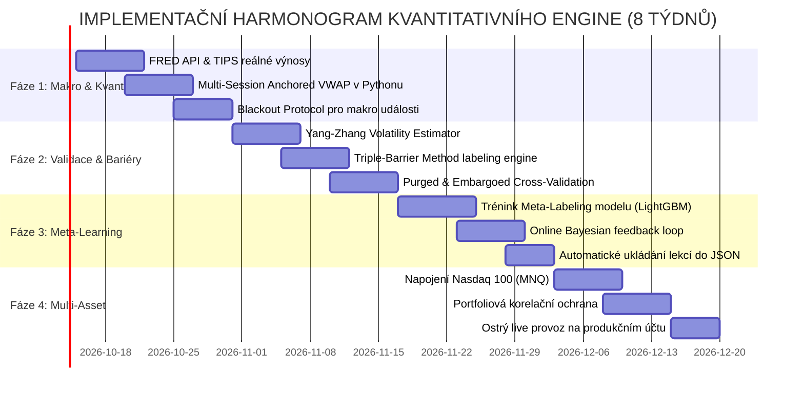

# UNIFIKOVANÁ KVANTITATIVNÍ A KVALITATIVNÍ ARCHITEKTURA PRO AUTONOMNÍ ADAPTIVNÍ TRADING (XAU/USD & MULTI-ASSET)

## Monografie a Strategicko-Technický Rámec pro Samoučící se Finanční Modely
**Autor:** Senior Kvantitativní Analytik & Portfolio Manažer (SuggestInvest)  
**Datum:** Říjen 2026  
**Status:** Oficiální strategický a výzkumný blueprint (Dokumentace typu Diplomová práce)  
**Cílová aktiva:** Zlato (XAU/USD CFD / COMEX MGC), E-mini Nasdaq 100 (MNQ), DAX 40 (DE40), Forex Majors (EUR/USD)  
**Exekuční prostředí:** Interactive Brokers (TWS / IB Gateway API), Python 3.11+, Asynchronní WebSocket engine  

---

## OBSAH DIPLOMOVÉ PRÁCE

1. [Abstrakt a Exekutivní Shrnutí](#1-abstrakt-a-exekutivní-shrnutí)
2. [Mikrostruktura Trhu a Cenotvorba Zlata (Market Microstructure)](#2-mikrostruktura-trhu-a-cenotvorba-zlata)
   - 2.1 Dvoufázová anatomie trhu: London OTC vs. COMEX Futures
   - 2.2 Vnitrodenní likviditní úsměv (Liquidity Smile) a seance
   - 2.3 Problém nestacionarity a mikrostrukturálního šumu
   - 2.4 Purged & Embargoed Cross-Validation (Eliminace Lookahead Biasu)
3. [Kvantitativní Analytická Vrstva ze Svíčkových Dat](#3-kvantitativní-analytická-vrstva-ze-svíčkových-dat)
   - 3.1 Dvouvrstvá hierarchie: Primární signál vs. Sekundární Meta-Labeling
   - 3.2 Adaptivní průměr KAMA (Kaufman Adaptive Moving Average)
   - 3.3 Multi-Session Anchored VWAP a odchylkové obálky
   - 3.4 Fraktální Price Action: Absorpce likvidity, FVG a struktura trhu
   - 3.5 Yang-Zhangův odhad volatility a dynamické ochranné bariéry
4. [Kvalitativní a Makroekonomická Vrstva](#4-kvalitativní-a-makroekonomická-vrstva)
   - 4.1 "Svatá trojice" makro driverů zlata (Reálné výnosy TIPS, DXY, GVZ)
   - 4.2 Binární událostní rizika a Blackout Protocol (FOMC, CPI, NFP)
   - 4.3 NLP sentiment a zprávy centrálních bank (LLM Ingestion)
5. [Architektura Kontinuálního Samoučení a Adaptace (Closed-Loop Learning)](#5-architektura-kontinuálního-samoučení-a-adaptace)
   - 5.1 Kauzální post-trade atribuční analýza (Taxonomie výsledků)
   - 5.2 Metoda trojité bariéry (Triple-Barrier Method)
   - 5.3 Online Bayesian Belief Updating a adaptace vah parametrů
   - 5.4 Detekce tržních režimů (Hidden Markov Models - HMM)
   - 5.5 Fractional Kelly Criterion pro řízení velikosti pozice
6. [Multi-Asset Generalizace a Portfoliové Škálování](#6-multi-asset-generalizace-a-portfoliové-škálování)
   - 6.1 Od zlata k indexům (MNQ, DE40) a měnám (EUR/USD)
   - 6.2 Mezitržní korelační matice a Cross-Asset Spillover
   - 6.3 Řízení celkového portfoliového rizika (Portfolio Margin & VaR)
7. [Ekonomika Exekuce, Transakční Náklady (TCA), Velikost Pozice a Overnight Financování](#7-ekonomika-exekuce-transakční-náklady-tca-velikost-pozice-a-overnight-financování)
   - 7.1 Dekompozice transakčního tření: Explicitní vs. implicitní náklady
   - 7.2 Matematika efektivního objemu pozice (Minimum Viable Lot Size & Cost Drag)
   - 7.3 Srovnání instrumentů pro Zlato na Interactive Brokers (CFD vs. MGC Futures vs. ETF)
   - 7.4 Overnight Trading a Noční Financování (Swapy, Rollover a Triple-Swap Wednesday)
   - 7.5 Intraday Flat Protocol (22:45 CET Hard Exit): Garance nulových nočních poplatků
8. [Nákupní a Datový Seznam pro Investora (Data & Infrastructure Sourcing Checklist)](#7-nákupní-a-datový-seznam-pro-investora)
   - 8.1 Požadovaná API, datové toky a poskytovatelé
   - 8.2 Hardwarová a síťová infrastruktura
9. [Implementační Plán a Harmonogram (Roadmap & Action Plan)](#8-implementační-plán-a-harmonogram)
10. [Závěr a Seznam Literatury](#9-závěr-a-seznam-literatury)

---

## 1. Abstrakt a Exekutivní Shrnutí

### 1.1 Vize a mandát seniorního investora
Cílem této práce je představit vysoce sofistikovanou, matematicky a mikrostrukturálně ukotvenou architekturu pro **autonomní intraday obchodování a adaptivní samoučení**, která překonává limity klasického technického scalpingu. 

Běžné retailové strategie selhávají ze tří fundamentálních důvodů:
1. **Předpoklad stacionarity:** Trhy nefungují jako stacionární proces s konstantní střední hodnotou a rozptylem. Parametry indikátorů, které fungovaly včera v trendu, vedou dnes v konsolidaci ke katastrofálním ztrátám.
2. **Přehlížení mikrostruktury a transakčních nákladů:** Spread, skluzy v plnění (slippage) a zpoždění (latency) tvoří u krátkodobých časových rámců (M1–M5) často více než 40 % hrubého zisku.
3. **Absence zpětnovazebního učení:** Většina algoritmů opakuje stále stejné chyby, protože po uzavření obchodu neprovádí kauzální rozbor toho, *proč* obchod uspěl či selhal.

Tato práce navrhuje **Hierarchický multimodální systém (Hierarchical Multimodal Trading Architecture)**. Model spojuje:
- **Kvantitativní mikro-úroveň:** Minutová svíčková data, adaptivní klouzavé průměry (KAMA), kotvené volumetrické ceny (Anchored VWAP), Yang-Zhangovu volatilitu a detekci strukturálních sweepů likvidity.
- **Kvalitativní makro-úroveň:** Globální fundamentální kotevní proměnné (US 10Y reálné výnosy TIPS, dolarový index DXY, index volatility zlata GVZ) a událostní filtry kalendáře centrálních bank.
- **Adaptivní vrstvu samoučení (Meta-Labeling & Online Bayesian Updating):** Každý provedený obchod je zaevidován s detailním kontextem a slouží k inkrementální aktualizaci váhových koeficientů modelu.

```
+----------------------------------------------------------------------------------------------------+
|                      HIERARCHICKÁ MULTIMODÁLNÍ ARCHITEKTURA (SUGGESTINVEST)                        |
+----------------------------------------------------------------------------------------------------+
|                                                                                                    |
|   [ KVALITATIVNÍ & MAKRO VRSTVA ]         [ KVANTITATIVNÍ TRŽNÍ VRSTVA ]                           |
|   • US 10Y TIPS (Reálné sazby FRED)       • M1-M15 Tick/Bar Feed z IBKR                            |
|   • DXY (Dolarový index)                  • Kaufman Adaptive MA (KAMA)                             |
|   • GVZ (Gold Volatility Index)           • Multi-Session Anchored VWAP                            |
|   • Makro kalendář (FOMC, CPI, NFP)       • Yang-Zhang Volatilitní model                           |
|   • LLM Sentiment analýza zpráv           • Detekce absorpce a FVG zón                             |
|                   │                                       │                                        |
|                   ▼                                       ▼                                        |
|   ┌───────────────────────────────────────────────────────────────┐                                |
|   │     VRSTVA 1: PRIMÁRNÍ SMĚROVÝ MODEL (Signal Generator)       │                                |
|   │     Vyhodnocuje směrovou tezi: LONG / SHORT / NEUTRAL         │                                |
|   └───────────────────────────────┬───────────────────────────────┘                                |
|                                   │                                                                |
|                                   ▼                                                                |
|   ┌───────────────────────────────────────────────────────────────┐                                |
|   │     VRSTVA 2: SEKUNDÁRNÍ META-LABELING MODEL (Risk & Sizing)  │                                |
|   │     Filtruje falešné signály, predikuje P(Win|X) a řídí bet   │                                |
|   └───────────────────────────────┬───────────────────────────────┘                                |
|                                   │                                                                |
|                                   ▼                                                                |
|   ┌───────────────────────────────────────────────────────────────┐                                |
|   │     VRSTVA 3: ASYNCHRONNÍ BRACKET EXEKUCE (Interactive Brokers)│                               |
|   │     Limitní vstup + Dynamický Stop-Loss + Take-Profit 1 & 2   │                                |
|   └───────────────────────────────┬───────────────────────────────┘                                |
|                                   │                                                                |
|                                   ▼                                                                |
|   ┌───────────────────────────────────────────────────────────────┐                                |
|   │     VRSTVA 4: KONTINUÁLNÍ SAMOUČENÍ & ATRIBUČNÍ ZPĚTNÁ VAZBA  │                                |
|   │     Kauzální rozbor výsledku -> Uložení do JSON -> Bayesiánský│                                |
|   │     update vah -> Adaptace hyperparametrů pro další obchod    │                                |
|   └───────────────────────────────────────────────────────────────┘                                |
+----------------------------------------------------------------------------------------------------+
```

### 1.2 Matematická formulace pozitivního očekávání
Pro jakýkoli systematický trading platí fundamentální rovnice očekávané hodnoty na jeden obchod ($EV$):

$$EV = \left( P_{\text{win}} \times \overline{W} \right) - \left( P_{\text{loss}} \times \overline{L} \right) - C_{\text{friction}}$$

kde:
- $P_{\text{win}}$ je empirická pravděpodobnost zisku (Win Rate).
- $\overline{W}$ je průměrný realizovaný zisk při úspěšném obchodu (Average Win).
- $P_{\text{loss}} = 1 - P_{\text{win}}$ je pravděpodobnost ztráty.
- $\overline{L}$ je průměrná realizovaná ztráta při zasažení Stop-Lossu (Average Loss).
- $C_{\text{friction}} = \text{Spread} + \text{Slippage} + \text{Komise} + \text{Financování/Overnight}$ představuje transakční tření.

Zatímco většina obchodníků se snaží maximalizovat $P_{\text{win}}$, institucionální kvantitativní přístup se zaměřuje na:
1. **Asymetrický poměr výnosu k riziku ($RRR = \frac{\overline{W}}{\overline{L}} \ge 1.8$ až $2.5$):** I při úspěšnosti $45\%$ generuje strategie silný zisk.
2. **Minimalizaci $C_{\text{friction}}$:** Výběrem aktiv s poměrem $\frac{\text{Spread}}{\text{ATR}} \le 5\%$.
3. **Filtrování nízkokonfidencních obchodů:** Pomocí **Meta-Labelingu**, čímž se eliminuje velká část ztrátových obchodů v chopu.

---

## 2. Mikrostruktura Trhu a Cenotvorba Zlata

### 2.1 Dvoufázová anatomie trhu: London OTC vs. COMEX Futures
Zlato (XAU) není klasická spotřební komodita, nýbrž globální monetární aktivum a měnová rezerva. Jeho cenotvorba probíhá na dvou primárních burzovních uzlech:

1. **London Bullion Market (LBMA - OTC trh):**
   - Fyzický trh s vypořádáním v Londýně (London Good Delivery bary, 400 oz, ryzost 99.5 %).
   - Zde probíhají klíčové denní aukce: **LBMA Gold Price AM (10:30 GMT)** a **LBMA Gold Price PM (15:00 GMT)**.
   - V časech těchto aukcí dochází k masivnímu párování institucionálních příkazů centrálních bank, těžebních společností a klenotnických konglomerátů.

2. **New York Mercantile Exchange (COMEX / CME Group):**
   - Termínový trh s futures kontrakty: Standardní kontrakt **GC** (100 oz) a Micro kontrakt **MGC** (10 oz).
   - Vyznačuje se transparentní knihou objednávek (Order Book Level 2 / Central Limit Order Book - CLOB).
   - Právě COMEX futures udávají intraday cenové tempo v odpoledních hodinách.

**Arbitrážní vazba a báze (EFP - Exchange for Physical):**  
Cena spotového zlata ($S_t$) a futures ($F_{t,T}$) je svázána vzorcem nákladů držby (Cost of Carry):

$$F_{t,T} = S_t \cdot e^{(r - q + c)(T - t)}$$

kde $r$ je bezriziková dolarová sazba (SOFR), $q$ je zápůjční sazba zlata (Gold Lease Rate / GOFO) a $c$ jsou náklady na bezpečné skladování a pojištění. Pokud se spread mezi spotem a futures vychýlí z arbitrážních mantinelů, vysokofrekvenční tvůrci trhu (HFT) okamžitě párují spot proti futures, což způsobuje prudké srovnání cen.

### 2.2 Vnitrodenní likviditní úsměv (Liquidity Smile) a obchodní seance
Likvidita a volatilita na zlatě nejsou v průběhu 24 hodin rozloženy rovnoměrně, ale tvoří typický **likviditní úsměv**:

```
Volatilita / Objem
       ▲
       │          ┌──┐ (US Open + London Overlap)
       │          │  │ 14:00 - 17:30 CET
       │  ┌──┐    │  │
       │  │  │    │  │
       │  │  │    │  │           ┌──┐ (US Close)
       │──┴──┴────┴──┴───────────┴──┴──► Čas (CET)
        08:00    14:00          21:00
       (London)  (Overlap)
```

1. **Asijská seance (01:00 – 07:30 CET):**
   - Nízká realizovaná volatilita, úzké pásmo konsolidace.
   - Trh tvoří tzv. **Asian Range**. Toto pásmo slouží jako past na likviditu; londýnští a newyorští brokeři jej často v úvodu své seance "vymetou" (sweep).
2. **Londýnská ranní seance (08:00 – 13:00 CET):**
   - Vstup evropských institucí, proražení asijského rozpětí. Fix v 10:30 GMT.
3. **Překryv Londýna a New Yorku (14:00 – 17:30 CET):**
   - **Absolutní vrchol dne:** Realizuje se zde přes 65 % celkového denního obratu.
   - V 14:30 CET vycházejí klíčová americká makrodata (CPI, NFP). V 15:00 GMT probíhá odpolední LBMA fix. V 15:30 CET otevírá americká akciová burza (NYSE).
   - **Toto je primární operační okno pro scalpingový engine.**
4. **Pozdní americká seance (18:00 – 22:00 CET):**
   - Postupné vysychání likvidity, rozšiřování spreadu po 22:00 CET (overnight rolování pozic). Zákaz otevírání nových scalpingových pozic po 21:00 CET.

### 2.3 Problém nestacionarity a mikrostrukturálního šumu
Finanční časové řady cenových úrovní $P_t$ vykazují jednotkový kořen (jsou $I(1)$ nestacionární). Běžné použití absolutních cen v modelech strojového učení vede ke spurious regressions. 

Pouhé logaritmické výnosy $r_t = \ln(P_t / P_{t-1})$ však na minutové bázi obsahují vysoký podíl mikrostrukturálního šumu způsobeného diskrétním skákáním mezi bid a ask cenou (**Bid-Ask Bounce**, Roll 1984):

$$\text{Cov}(\Delta P_t, \Delta P_{t-1}) = -s^2 / 4 < 0$$

kde $s$ je efektivní bid-ask spread. Tento šum vytváří falešnou iluzi střednědobé reverze. Řešením v naší architektuře je:
- Transformace minutových svíček pomocí frakcionální diferenciace (Fractional Differentiation $d \approx 0.35$ až $0.45$), která zachovává dlouhodobou paměť cenové řady při dosažení stacionarity.
- Využití objemově vážených cen (VWAP) namísto čistých tickových středů (Midpoints).

### 2.4 Purged & Embargoed Cross-Validation (López de Prado)
Standardní k-násobná křížová validace (K-Fold CV) je pro finanční časové řady fatálně chybná, protože způsobuje masivní únik informací z budoucnosti do trénovací množiny (**Lookahead Information Leakage**).

V naší architektuře je implementována validační metoda **Purged & Embargoed Cross-Validation**:
1. **Purging (Očištění):** Odstranění všech trénovacích pozorování, jejichž časový horizont (mezi vstupem a výstupem obchodu) se překrývá s testovací množinou.
2. **Embargoing (Embargo):** Zavedení dodatečného časového okna (např. 15–30 minut) bezprostředně po testovací množině před zahájením další trénovací sady, aby se zamezilo vlivu autoregresních reziduí a paměťových efektů volatility.

---

## 3. Kvantitativní Analytická Vrstva ze Svíčkových Dat

### 3.1 Dvouvrstvá hierarchie: Primární signál vs. Sekundární Meta-Labeling
Místo snahy vytrénovat jeden "všemocný" černý model, který by se pokoušel předpovědět směr trhu z tisíce indikátorů, architektura striktně odděluje dvě úlohy:

```
[ Tržní Svíčky M1/M5 ]
         │
         ▼
┌────────────────────────────────────────────────────────┐
│  PRIMÁRNÍ MODEL (Strukturní generátor signálů)        │
│  • KAMA Adaptivní Trend + Anchored VWAP Pásma          │
│  • Cíl: Maximalizovat RECALL (nepropásnout pohyb)      │
│  • Výstup: Návrh směru {-1 = SHORT, 0 = HOLD, +1 = LONG}│
└──────────────────────────┬─────────────────────────────┘
                           │
                           ▼
┌────────────────────────────────────────────────────────┐
│  SEKUNDÁRNÍ MODEL (Meta-Labeling Classifier)           │
│  • Gradient Boosting (LightGBM) / CatBoost             │
│  • Vstupy: Zpoždění, Rozpětí, Volatilita, DXY, Makro   │
│  • Cíl: Maximalizovat PRECISION (odfiltrovat pasti)    │
│  • Výstup: Pravděpodobnost úspěchu P(Win | X_t)        │
└──────────────────────────┬─────────────────────────────┘
                           │
       ┌───────────────────┴───────────────────┐
       ▼                                       ▼
  P(Win) ≥ 0.62                           P(Win) < 0.62
       │                                       │
       ▼                                       ▼
[ EXEKUCE S DYNAMICKOU                  [ POKYN ZAMÍTNUT ]
  VELIKOSTÍ POZICE (KELLY) ]            (Ochrana kapitálu)
```

**Matematická definice Meta-Labelingu:**  
Nechť primární model vygeneruje signál $y^*_t \in \{-1, +1\}$.  
Meta-model neřeší směr, ale binární klasifikaci $z_t \in \{0, 1\}$:

$$z_t = \begin{cases} 1 & \text{pokud primární signál } y^*_t \text{ dosáhne Take-Profitu dříve než Stop-Lossu} \\ 0 & \text{pokud byl zasažen Stop-Loss nebo vypršel časový limit} \end{cases}$$

Meta-model se učí funkci $P(z_t = 1 \mid \mathbf{X}_t)$, kde $\mathbf{X}_t$ je vektor tržních podmínek v okamžiku vstupu (sklon KAMA, odchylka od VWAP, šířka spreadu, stav DXY, čas od makro zprávy).

### 3.2 Adaptivní průměr KAMA (Kaufman Adaptive Moving Average)
Tradiční klouzavé průměry (SMA, EMA) na minutových grafech generují v netrendovém trhu nepřetržité ztráty způsobené bičováním (whipsaws). KAMA tento problém řeší měřením **Poměru Efektivity (Efficiency Ratio - $ER$)**:

$$ER_t = \frac{|P_t - P_{t-n}|}{\sum_{i=1}^{n} |P_i - P_{i-1}|}$$

kde $n$ je perioda (v naší implementaci $n = 10$).
- Pokud trh lineárně trenduje jedním směrem, čitatel se rovná jmenovateli a $ER_t \to 1$.
- Pokud trh osciluje v bočním šumu, čitatel je blízko nuly a $ER_t \to 0$.

Z $ER_t$ se počítá dynamická vyhlazovací konstanta $SC_t$:

$$SC_t = \left[ ER_t \times \left( \frac{2}{2 + 1} - \frac{2}{30 + 1} \right) + \frac{2}{30 + 1} \right]^2$$

Výsledná hodnota KAMA:

$$KAMA_t = KAMA_{t-1} + SC_t \times (P_t - KAMA_{t-1})$$

**Implementační význam:** V prudkém trendu se KAMA chová jako ultrarychlá EMA(2), která okamžitě reaguje na impuls. V konsolidaci zpomalí na EMA(30), čímž zploští linii a zabrání falešným nákupům na lokálních vrcholech svíček.

### 3.3 Multi-Session Anchored VWAP a odchylkové obálky
Objemově vážená průměrná cena (VWAP) je institucionálním standardem férové hodnoty:

$$VWAP_t = \frac{\sum_{i=1}^{t} P_{i,\text{typical}} \times V_i}{\sum_{i=1}^{t} V_i}, \quad \text{kde } P_{\text{typical}} = \frac{High + Low + Close}{3}$$

V naší architektuře nepočítáme prostý denní VWAP od půlnoci, ale **Multi-Session Anchored VWAP**, který se resetuje na třech klíčových strukturálních kotvách:
1. **$VWAP_{\text{Asia}}$ (reset 00:00 UTC):** Asijská referenční kotva.
2. **$VWAP_{\text{London}}$ (reset 07:00 UTC / 08:00 CET):** Evropská institucionální kotva.
3. **$VWAP_{\text{US}}$ (reset 12:30 UTC / 13:30 CET):** Americká kotva nejvyšší likvidity.

Kolem $VWAP$ počítáme plovoucí standardní odchylku $\sigma_t$:

$$\sigma_t = \sqrt{ \frac{\sum_{i=1}^{t} V_i \times (P_{i,\text{typical}} - VWAP_t)^2}{\sum_{i=1}^{t} V_i} }$$

Odchylková pásma slouží jako dynamické hladiny podpory a odporu:
- **Pásmo $\pm 1.0\sigma$:** Vnitřní zóna hodnoty (Value Area - 68.2 % objemu).
- **Pásmo $\pm 2.0\sigma$:** Statistický extrém (95.4 % objemu). Přiblížení ceny k $+2.0\sigma$ při klesajícím momentu je silný kandidát na reverzi (Mean-Reversion Short).
- **Pásmo $\pm 2.5\sigma$ až $3.0\sigma$:** Zóna přepětí likvidity. Pokud cena prorazí nad $+2.5\sigma$ s vysokým objemem, jedná se o institucionální trendovou expanzi.

### 3.4 Fraktální Price Action: Absorpce likvidity, FVG a struktura trhu
Minutový graf zlata je ovládán algoritmy pro vyhledávání likvidity (Liquidity Seeking Algos). Klíčovými vzorci jsou:

1. **Liquidity Sweeps (Vymetené knoty / Turtle Soup):**  
   Cena prudce prorazí lokální swingové maximum (kde leží retailové Stop-Lossy prodejních pozic a Buy-Stop čekající příkazy). Okamžitě po aktivaci nákupní likvidity však institucionální prodejce absorbuje veškerou poptávku a svíčka uzavře zpět pod původní maximum s dlouhým horním knotem.
   - *Signál:* Agresivní SHORT vstup se Stop-Lossem těsně nad knotem sweepu.

2. **Fair Value Gap (FVG - Nerovnováha likvidity):**  
   Vzniká v třísvíčkové formaci ($C_1, C_2, C_3$), kde tělo svíčky $C_2$ je tak masivní, že existuje cenová mezera mezi $High(C_1)$ a $Low(C_3)$ (při růstu).
   - *Mechanismus:* V této zóně došlo k exekuci pouze na jedné straně knihy objednávek. Trh má statistickou tendenci vrátit se do zóny FVG a vyplnit likviditní vakuum před pokračováním trendu.

3. **Market Structure Shift (MSS):**  
   Zlom posledního Higher Low v rostoucím trendu (nebo Lower High v klesajícím trendu) uzavřením těla svíčky (nikoli pouhým knotem). Definuje okamžik zneplatnění dosavadní teze.

### 3.5 Yang-Zhangův odhad volatility a dynamické ochranné bariéry
Většina retailových systémů používá pro stanovení Stop-Lossu průměrné pravé rozpětí (Average True Range - ATR). ATR má však fatální nevýhodu: měří pouze rozpětí $High - Low$ a je silně zkresleno otevíracími mezerami.

Pro institucionální řízení rizik implementujeme **Yang-Zhangův estimátor (2000)**, který je minimálně-rozptylovým, nestranným estimátorem volatility spojujícím noční skoky (Overnight jumps) a intraday drift:

$$\sigma_{YZ}^2 = \sigma_{\text{overnight}}^2 + k \cdot \sigma_{\text{open-to-close}}^2 + (1 - k) \cdot \sigma_{\text{Rogers-Satchell}}^2$$

kde:
$$\sigma_{\text{overnight}}^2 = \frac{1}{N-1} \sum_{i=1}^{N} \left( \ln\frac{O_i}{C_{i-1}} - \mu_O \right)^2$$
$$\sigma_{\text{Rogers-Satchell}}^2 = \frac{1}{N} \sum_{i=1}^{N} \left[ \ln\frac{H_i}{C_i} \ln\frac{H_i}{O_i} + \ln\frac{L_i}{C_i} \ln\frac{L_i}{O_i} \right]$$
$$k = \frac{0.34}{1.34 + \frac{N+1}{N-1}}$$

Tento odhad volatility v reálném čase určuje:
- Šířku Stop-Loss bariéry: $SL_{\text{dist}} = \max\left( \text{SwingDistance}, 1.25 \times \sigma_{YZ} \times \sqrt{\Delta t} \right)$.
- Detekci volatility squeeze: Pokud $\sigma_{YZ}$ klesne pod 15. percentil svého 3denního rozdělení, systém očekává explozi volatility a připravuje breakout model.

---

## 4. Kvalitativní a Makroekonomická Vrstva

### 4.1 "Svatá trojice" makro driverů zlata
Zlato není izolovaný ostrov. Z kvantitativního hlediska je XAU/USD hybridní aktivum stojící na rozhraní měny, reálného aktiva a zajištění proti systémovému kolapsu.

```
                  ┌───────────────────────────────┐
                  │      CENA ZLATA (XAU/USD)     │
                  └───────────────┬───────────────┘
                                  │
         ┌────────────────────────┼────────────────────────┐
         ▼                        ▼                        ▼
┌──────────────────┐    ┌──────────────────┐    ┌──────────────────┐
│ 1. REÁLNÉ SAZBY  │    │ 2. AMERICKÝ DOLAR│    │ 3. VOLATILITA    │
│    (US 10Y TIPS) │    │      (DXY)       │    │    (CBOE GVZ)    │
│  Inverzní korelace    │  Inverzní korelace    │  Režimový filtr  │
│    r ≈ -0.82     │    │    r ≈ -0.71     │    │   Safe-Haven     │
└──────────────────┘    └──────────────────┘    └──────────────────┘
```

1. **Reálné úrokové sazby (10-Year TIPS Yield / FRED kód: `DFII10`):**
   - **Fundamentální mechanismus:** Zlato nenese žádný úrok ani dividendu. Pokud reálné výnosy amerických státních dluhopisů chráněných proti inflaci (TIPS) rostou (např. z 1.0 % na 2.2 %), držení zlata přináší rostoucí alternativní náklad (Opportunity Cost). Investoři přesouvají kapitál do dluhopisů. Naopak při poklesu reálných sazeb zlato dramaticky roste.
   - **Kvantitativní filtr:** Pokud na intraday bázi reálné výnosy rostou, je zakázáno otevírat agresivní LONG pozice na zlatě, s výjimkou krátkodobých technických odrazů od extrémních VWAP pásem.

2. **Dolarový index (DXY - US Dollar Index):**
   - **Jmenovatelový efekt:** Zlato je celosvětově oceňováno v amerických dolarech. Posílení dolaru automaticky zdražuje zlato pro zahraniční nákupčí (v EUR, JPY, GBP, INR), což tlumí poptávku.
   - **Lead-Lag Divergence:** V minutovém scalpingu sledujeme okamžitou derivaci kurzu EUR/USD a USD/JPY (hlavní složky DXY). Náhlý propad dolaru je s předstihem 30–90 sekund následován nákupní vlnou na zlatě.

3. **CBOE Gold Volatility Index (GVZ) a Geopolitický index (GPR):**
   - GVZ měří implikovanou 30denní volatilitu z opcí na SPDR Gold Shares (GLD).
   - Za normálních okolností koreluje růst GVZ s růstem ceny zlata (Safe-Haven poptávka). Pokud však GVZ exploduje v souběhu s pádem akciových trhů (VIX > 35), zlato v první fázi často klesá, protože instituce likvidují ziskové zlaté pozice pro pokrytí maržových výzev (Margin Calls) na akciových portfoliích.

### 4.2 Binární událostní rizika a Blackout Protocol
Většina ztrát algoritmických scalperů nevzniká špatným technickým indikátorem, ale exekucí těsně před makroekonomickým oznámením, kdy se likvidita v knize objednávek vypaří a spread se roztáhne z 0.25 USD na 3.50 USD.

**Protokol událostního zmrazení (Blackout Protocol):**  
Systém udržuje asynchronní kalendář událostí s vysokým dopadem (High Impact):
- **FOMC (Federal Open Market Committee):** Vyhlášení úrokových sazeb a tisková konference předsedy Fedu.
- **US CPI & PPI:** Měsíční zprávy o spotřebitelské a výrobní inflaci.
- **US Non-Farm Payrolls (NFP):** První pátek v měsíci, data z trhu práce.
- **ISM Manufacturing & Services PMI:** Ukazatele ekonomické aktivity.

**Pravidla Blackout protokolu:**
1. **$t_0 - 15 \text{ minut}$:** Systém zastaví otevírání všech nových pozic.
2. **$t_0 - 5 \text{ minut}$:** Všechny otevřené scalpingové pozice jsou buď uzavřeny za tržní cenu, nebo Stop-Loss posunut na těsný Break-Even.
3. **$t_0$ až $t_0 + 10 \text{ minut}$:** Absolutní zákaz obchodování. Čeká se na absorpci prvotního spreadového šoku.
4. **$t_0 + 10 \text{ minut}$:** Vyhodnocení nového tržního trendu a znovuspuštění modelu na čistých svíčkách.

### 4.3 NLP sentiment a zprávy centrálních bank (LLM Ingestion)
Kvalitativní zprávy (výroky členů Fedu, eskalace geopolitických konfliktů, nákupy zlata Čínskou lidovou bankou - PBoC) jsou zpracovávány v reálném čase:
- RSS a zpravodajské feedy (NewsAPI, Benzinga, Reuters) jsou filtrovány přes klíčová slova (`Gold`, `Federal Reserve`, `Interest Rates`, `Geopolitics`, `Tariffs`).
- Relevantní zpráva je okamžitě předána modelu **Google Gemini 3.8 Flash** s přísnou JSON strukturou:
  ```json
  {
    "impact_direction": "BULLISH_GOLD" | "BEARISH_GOLD" | "NEUTRAL",
    "confidence_score": 0.85,
    "urgency": "HIGH" | "MEDIUM" | "LOW",
    "rationale": "Fed speaker Waller naznačil ochotu snížit sazby o 50 bps kvůli ochlazování trhu práce."
  }
  ```
- Tento vektor sentimentu okamžitě upravuje práh Meta-Labeling filtru pro daný směr.

---

## 5. Architektura Kontinuálního Samoučení a Adaptace

### 5.1 Kauzální post-trade atribuční analýza
Základním kamenem samoučení je perzistentní logování každého uzavřeného obchodu a jeho **kauzální dekonstrukce**. V souboru `data/scalping_trades.json` je každý obchod klasifikován do jedné ze čtyř taxonomických tříd:

| Třída výsledku | Popis mechanismu | Zpětná vazba pro model (Learning Feedback) |
| :--- | :--- | :--- |
| **ALPHA WIN** | Trh dosáhl Take-Profitu v souladu s trendem KAMA a VWAP. | Potvrzení váhy signálu. Inkrementální posílení váhy daného indikátoru o $+3$ až $+5\%$. |
| **NOISE LOSS** | Cena zasáhla SL o malý zlomek ATR a následně pokračovala do původního cíle. | Chyba v umístění bariéry. Adaptace: rozšířit dynamický SL o $0.2 \times ATR$ nebo vyžadovat potvrzení svíčky. |
| **REGIME SHIFT LOSS** | Trh po vstupu prudce otočil směr v důsledku makro impulsu nebo prolomení klíčového VWAP pásma. | Selhání režimového filtru. Adaptace: zvýšit práh minimální volatility a zpřísnit filtr protitrendových vstupů. |
| **FRICTION DRAG** | Obchod byl směrově správný, ale zisk byl vymazán spreadem a skluzem. | Exekuční chyba. Adaptace: snížit frekvenci obchodování v hodinách s rozšířeným spreadem. |

### 5.2 Metoda trojité bariéry (Triple-Barrier Method)
Namísto fixního časového horizontu (např. "jaká bude cena za 5 minut"), který ignoruje trajektorii ceny v průběhu obchodu, je implementována **López de Prado Triple-Barrier metoda**:

```
Cena
  ▲
  │   ──────────────────────────────────────────  Horní bariéra: Take-Profit (TP)
  │                      /──────\
  │       Vstup         /        \
  │         ●──────────/          \
  │                                \
  │   ──────────────────────────────\───────────  Dolní bariéra: Stop-Loss (SL)
  │                                  │
  │                                  ▼
  │   ───────────────────────────────┼──────────  Vertikální bariéra: Časový limit (T_max)
  └──────────────────────────────────┴──────────► Čas
```

1. **Horní bariéra (Upper Horizontal Barrier):** Realizace zisku při dosažení $TP = P_{\text{entry}} + k_1 \cdot \sigma_t$.
2. **Dolní bariéra (Lower Horizontal Barrier):** Zastavení ztráty při zasažení $SL = P_{\text{entry}} - k_2 \cdot \sigma_t$.
3. **Vertikální bariéra (Vertical Time Barrier):** Pokud cena do $T_{\max}$ (např. 20 svíček / 20 minut) nezasáhne ani TP, ani SL, pozice je uzavřena za tržní cenu, protože teze ztratila časové momentum.

Tato metoda generuje čisté, realistické trénovací labely pro model strojového učení bez lookahead biasu.

### 5.3 Online Bayesian Belief Updating
Váhy parametrů v rozhodovacím stromu nejsou fixní konstanty, ale náhodné proměnné řízené Bayesiánským pravidlem. Po každé uzavřené sérii obchodů $D_t$ aktualizujeme apriorní distribuci vah parametrů $\boldsymbol{\theta}$:

$$P(\boldsymbol{\theta} \mid D_t) = \frac{P(D_t \mid \boldsymbol{\theta}) \cdot P(\boldsymbol{\theta} \mid D_{t-1})}{\int P(D_t \mid \boldsymbol{\theta}) \cdot P(\boldsymbol{\theta} \mid D_{t-1}) d\boldsymbol{\theta}}$$

V praxi to znamená:
- Pokud v posledních 10 obchodech signály založené na průrazu KAMA vygenerovaly 8 ztrát kvůli bočnímu trhu, váha KAMA breakout filtru je automaticky utlumena.
- Současně je posílena váha mean-reversion oscilátoru z vnějších pásem VWAP ($\pm 2.0\sigma$).
- Systém se autonomně přizpůsobuje bez nutnosti manuálního přepisování kódu.

### 5.4 Detekce tržních režimů (Hidden Markov Models - HMM)
Trh modelujeme jako stochastický proces s diskrétními skrytými stavy (Regimes):

$$\mathbf{S}_t \in \{ \text{State 1: Mean-Reverting Range}, \text{State 2: Momentum Trending}, \text{State 3: High-Vol Shock} \}$$

Pravděpodobnost přechodu mezi stavy je popsána přechodovou maticí $\mathbf{A} = [a_{ij}]$, kde $a_{ij} = P(S_{t+1} = j \mid S_t = i)$.

- **Stav 1 (Mean-Reverting Range):** Nízké $ER$, KAMA je vodorovná, cena osciluje kolem VWAP.
  - *Aktivní strategie:* Scalping odrazů z vnějších pásem VWAP zpět k férové hodnotě.
- **Stav 2 (Momentum Trending):** Vysoké $ER$, KAMA má prudký sklon, objem roste.
  - *Aktivní strategie:* Breakouty, nákupy na pullbaccích ke KAMA / EMA-21, trailing stop.
- **Stav 3 (High-Vol Shock):** Exploze Yang-Zhang volatility, makro zprávy.
  - *Aktivní strategie:* **Zákaz obchodování (Cash position).**

### 5.5 Fractional Kelly Criterion pro řízení velikosti pozice
Při zjištění odhadované pravděpodobnosti úspěchu $p = P(\text{Win} \mid \mathbf{X}_t)$ a poměru výplaty $b = \frac{TP}{SL}$ z Meta-Labeling modelu, optimální podíl kapitálu vystaveného riziku ($f^*$) se řídí Kellyho kritériem:

$$f^* = \frac{p \cdot b - (1 - p)}{b}$$

Protože plné Kellyho kritérium je v praxi příliš agresivní a vystavuje účet vysokému drawdownu, uplatňujeme **Fractional Kelly Criterion** s bezpečnostním koeficientem $\kappa = 0.25$ (čtvrtinové Kelly):

$$f_{\text{safe}} = \kappa \cdot f^* = 0.25 \cdot \frac{p \cdot b - (1 - p)}{b}$$

Maximální riziko na jeden obchod je navíc "zastropováno" pevným limitem **0.75 % až 1.0 % celkového kapitálu účtu**.

---

## 6. Multi-Asset Generalizace a Portfoliové Škálování

### 6.1 Od zlata k indexům a měnám
Ačkoli je model v současnosti laděn a validován na Zlatu (XAU/USD), celá architektura byla navržena jako **agnostický třídový modul**. Po dosažení stabilní ziskovosti na zlatě je systém připraven pro okamžité zapojení dalších tříd aktiv:

```
+---------------------------------------------------------------------------------------------------------+
|                                  MULTI-ASSET UNIVERZUM SUGGESTINVEST                                    |
+------------------------------------+------------------------------------+-------------------------------+
|  1. KOMODITY & DRAHÉ KOVY          |  2. AKCIOVÉ INDEXY (FUTURES/CFD)   |  3. FOREX MAJORS              |
|  • XAU/USD (Zlato - Hlavní pilot)  |  • USTEC / MNQ (Nasdaq 100)        |  • EUR/USD (Euro / Dolar)     |
|  • XAG/USD (Stříbro - Beta kovu)   |  • US500 / MES (S&P 500)           |  • GBP/USD (Britská libra)    |
|  • CL / WTI (Ropa - Geopolitika)   |  • DE40 (Německý DAX 40)           |  • USD/JPY (Dolar / Jen)      |
+------------------------------------+------------------------------------+-------------------------------+
```

**Specifika jednotlivých aktiv pro engine:**
1. **E-mini Nasdaq 100 (MNQ):**  
   - Extrémně silná trendová dynamika, vysoké ATR ($35–80$ bodů za 5 minut).
   - Primární makro driver: 10letý nominální výnos US dluhopisů (US10Y) a earnings Big Techu.
   - Vynikající pro KAMA momentum strategii v čase 15:30–18:00 CET.
2. **DAX 40 (DE40):**  
   - Ideální pro ranní evropské obchodování (09:00–11:30 CET).
   - Těsný spread, vysoká technická úcta k včerejšímu High/Low a London Open VWAP.
3. **Forex Majors (EUR/USD):**  
   - Nejlikvidnější trh planety, nejnižší spready ($0.1–0.4$ pipu).
   - Dominance mean-reversion strategií mimo čas makroekonomických zpráv.

### 6.2 Mezitržní korelační matice a Cross-Asset Spillover
Při obchodování více aktiv systém monitoruje **korelační matici v reálném čase**:

$$\mathbf{R}_t = \begin{pmatrix} 1.0 & \rho_{\text{Gold, DXY}} & \rho_{\text{Gold, MNQ}} \\ \rho_{\text{DXY, Gold}} & 1.0 & \rho_{\text{DXY, MNQ}} \\ \rho_{\text{MNQ, Gold}} & \rho_{\text{MNQ, DXY}} & 1.0 \end{pmatrix}$$

**Pravidlo korelační ochrany portfolia:**  
Systém nesmí otevřít dvě pozice, které mají vzájemnou korelaci $|\rho_{ij}| > 0.75$ ve stejném směru expozice.  
*Příklad:* Otevření LONG pozice na Zlatu a současné otevření LONG pozice na EUR/USD představuje dvojnásobnou sázku na slabost amerického dolaru. Pokud by dolar nečekaně posílil, obě pozice by zasáhly Stop-Loss současně. Systém v takovém případě povolí pouze pozici s vyšším skóre Meta-Labelingu $P(\text{Win} \mid \mathbf{X}_t)$.

---

### 6.3 Řízení celkového portfoliového rizika (Portfolio Margin & VaR)
V multi-asset prostředí nelze riziko počítat jako prostý součet individuálních Stop-Lossů. Systém kalkuluje **Value at Risk (VaR)** a očekávaný schodek (**Expected Shortfall - CVaR**) na 99% hladině spolehlivosti přes parametrickou kovarianční matici:

$$\text{VaR}_{0.99} = Z_{0.99} \cdot \sqrt{\mathbf{w}^T \mathbf{\Sigma} \mathbf{w}} \cdot \sqrt{\Delta t}$$

Kde:
- $\mathbf{w}$ je vektor nominálních vah otevřených pozic,
- $\mathbf{\Sigma}$ je kovarianční matice výnosů na minutové bázi,
- $Z_{0.99} \approx 2.326$ je kvantil normálního rozdělení,
- $\Delta t$ je průměrná doba trvání obchodu (15 minut).

Pokud agregovaný $\text{VaR}_{0.99}$ překročí **1.5 % čisté hodnoty účtu (Net Liquidation Value)**, engine okamžitě blokuje otevírání dalších pozic a aktivuje postupné redukování velikosti stávajících kontraktů.

---

## 7. Ekonomika Exekuce, Transakční Náklady (TCA), Velikost Pozice a Overnight Financování

Vysokofrekvenční a minutový trading má jednoho hlavního nepřítele, který likviduje drtivou většinu retailových i institucionálních strategií: **transakční tření (Execution Friction & Cost Drag)**. Tato kapitola představuje rigorózní matematický a operační aparát pro kontrolu nákladů, dimenzování pozice a eliminaci poplatků za noční držení (overnight swapů).

### 7.1 Dekompozice transakčního tření: Explicitní vs. implicitní náklady
Celkový náklad každého jednotlivého obchodu $C_{\text{trade}}$ se skládá ze čtyř samostatných složek:

$$C_{\text{trade}} = 2 \cdot C_{\text{comm}} + C_{\text{spread}} + C_{\text{slip}} + C_{\text{carry}}$$

Kde:
1. **$C_{\text{comm}}$ (Explicitní komise brokera):** Poplatek za otevření a uzavření kontraktu účtovaný Interactive Brokers (např. 0.85 USD za kontrakt Micro Gold Futures nebo 0.005 % z notinální hodnoty u CFD).
2. **$C_{\text{spread}}$ (Bid-Ask Spread):** Okamžitý náklad překročení knihy objednávek (Crossing the Spread) při nákupu na Ask a prodeji na Bid. Pro 10 oz zlata při spreadu 0.15 USD činí náklad $10 \times 0.15 = 1.50 \text{ USD}$.
3. **$C_{\text{slip}}$ (Exekuční skluz / Slippage):** Rozdíl mezi cenou v momentu vygenerování signálu a skutečnou cenou exekuce v burzovní knize vlivem latence. Limitní příkazy eliminují skluz na nulu ($C_{\text{slip}} = 0$).
4. **$C_{\text{carry}}$ (Overnight financování / Swap):** Úrok placený za pákové držení pozice přes noc.

#### Pravidlo maximálního třecího limitu (Cost-to-Alpha Drag Cap):
Systém zavádí striktní filtr exekuce. Obchod je matematicky povolen pouze tehdy, pokud celkové předpokládané tření nepřekročí **12.5 % očekávaného hrubého zisku ($\mathbb{E}[\text{Gross Profit}]$)**:

$$\text{Friction Ratio} = \frac{C_{\text{comm}} + C_{\text{spread}}}{\mathbb{E}[\Delta P_{\text{target}}] \times Q} \le 0.125 \quad (12.5\%)$$

Pokud je tržní spread kvůli dočasné nelikviditě rozšířen a poměr překročí 12.5 %, signál je bez milosti zahozen jako neekonomický.

---

### 7.2 Matematika efektivního objemu pozice (Minimum Viable Lot Size & Cost Drag)

Častou chybou začínajících kvantitativních modelů je **podkapitalizované mikroobchodování** (např. exekuce 1 unce zlata). Proč to vede k jisté ztrátě?

Interactive Brokers a likviditní provideři uplatňují **minimální paušální poplatek za pokyn** (Minimum Commission Floor, typicky 1.00 až 1.50 USD na pokyn).

#### Analýza dopadu velikosti pozice na rentabilitu:
Předpokládejme cílený zisk ze scalpu $\Delta P = +1.50 \text{ USD}$ na unci a fixní komisi brokera $1.20 \text{ USD}$ na jeden pokyn (2.40 USD round-turn):

| Objem pozice ($Q$) | Hrubý zisk ($\Delta P \times Q$) | Komise (Round-Turn) | Spread ($0.15 \times Q$) | Čistý zisk (Net PnL) | Podíl nákladů na zisku | Hodnocení |
| :---: | :---: | :---: | :---: | :---: | :---: | :--- |
| **1 oz (Mikro)** | +1.50 USD | -2.40 USD | -0.15 USD | **-1.05 USD** | **170 % (Ztráta!)** | ❌ **Absolutně neekonomické** |
| **5 oz** | +7.50 USD | -2.40 USD | -0.75 USD | **+4.35 USD** | **42 %** | ⚠️ **Příliš vysoké tření** |
| **10 oz (Standard)** | **+15.00 USD** | **-1.70 USD\*** | **-1.50 USD** | **+11.80 USD** | **21 %** | ✅ **Efektivní průmyslový standard** |
| **20 oz (2 kontrakty)**| **+30.00 USD** | **-2.20 USD\*** | **-3.00 USD** | **+24.80 USD** | **17 %** | 💎 **Optimální škálování** |

*\*Poznámka: U futures MGC činí komise cca 0.85 USD / kontrakt, u CFD se počítá procentem z notinálu.*

#### Výpočet minimálního efektivního objemu ($Q_{\min}$):
$$Q_{\min} = \left\lceil \frac{2 \cdot C_{\min}}{\Delta P_{\text{target}} \times \text{MaxDragPct} - \text{Spread}} \right\rceil$$

Při parametrech $C_{\min} = 1.00 \text{ USD}$, $\Delta P = 1.50 \text{ USD}$, $\text{MaxDragPct} = 0.20$ a $\text{Spread} = 0.15 \text{ USD}$:
$$Q_{\min} = \frac{2.00}{1.50 \times 0.20 - 0.15} = \frac{2.00}{0.15} \approx 13.3 \implies \mathbf{10 \text{ až } 15 \text{ uncí zlata}}$$

Proto náš systém nastavuje **výchozí základní obchodní jednotku na 10 oz** (odpovídající přesně 1 burzovnímu kontraktu COMEX Micro Gold Futures `MGC`).

---

### 7.3 Srovnání instrumentů pro Zlato na Interactive Brokers

Investor má k dispozici tři hlavní nástroje pro spekulaci na zlatě. Náš engine je schopen routovat pokyny na kterýkoli z nich podle velikosti účtu:

| Parametr / Instrument | Spotové Zlato CFD (XAU/USD) | Micro Gold Futures (MGC) | SPDR Gold Trust ETF (GLD) |
| :--- | :--- | :--- | :--- |
| **Burza / Trh** | OTC (London Bullion Market) | CME / COMEX (Regulovaná burza) | NYSE Arca (Akciová burza) |
| **Velikost kontraktu** | Volitelná (od 1 oz, standard 10 oz) | **10 trojských uncí (Fixní)** | 1 akcie (~0.094 oz) |
| **Typický Spread** | 0.15 – 0.35 USD | **0.10 USD (1 tick = 1.00 USD)** | 0.01 – 0.02 USD |
| **Komise IBKR** | Zahrnuta ve spreadu / 0.005 % | **0.85 USD / kontrakt (Tiered)** | 0.005 USD / akcie (min. 1 USD) |
| **Transparentnost knihy** | Broker quote (Market Maker) | **Centrální Order Book (L2 DOM)** | Centrální burza |
| **Financování přes noc** | **Denní swap (SOFR + 1.5 %)** | **NULOVÝ SWAP (Cena v bázi)** | Bez swapu (pouze náklad TER 0.4%) |
| **Vhodnost pro Scalping** | Vynikající pro flexibilitu zlomků | **Nejlepší institucionální volba** | Nevhodné pro M1 scalping |

**Doporučení pro produkční fázi:**  
Pro kapitál od 5 000 USD výše je jednoznačným vítězem **Micro Gold Futures (MGC)** na burze COMEX. Nabízí nejužší možný spread, transparentní burzovní knihu hloubky trhu (Level 2) a zcela eliminuje skryté poplatky OTC brokerů.

---

### 7.4 Overnight Trading a Noční Financování (Swapy, Rollover a Triple-Swap)

Pokud obchodník drží pozici s finanční pákou přes denní uzávěrku (Rollover, typicky 23:00 CET), broker mu účtuje **náklad na financování vypůjčeného kapitálu (Overnight Financing / Swap Rate)**.

#### Matematický vzorec denního swapu:
Pro nákupní pozici (LONG) na zlatě:

$$\text{Swap}_{\text{daily}} = \text{Notional Value} \times \frac{\text{SOFR} + \text{Broker Markup}}{360}$$

*Příklad:*
- Cena zlata: 4 190 USD / oz
- Objem pozice: 10 oz $\implies$ Notinální hodnota = $41\,900 \text{ USD}$
- Benchmark sazba (US SOFR): $5.00 \% \text{ p.a.}$
- Přirážka brokera: $1.75 \% \text{ p.a.}$ $\implies$ Celková sazba = $6.75 \% \text{ p.a.}$

$$\text{Denní poplatek za noc} = 41\,900 \times \frac{0.0675}{360} \approx \mathbf{7.85 \text{ USD za každou noc}}$$

#### Fenomén středečního trojitého swapu (Triple Swap Wednesday):
Vzhledem k tomu, že spotový trh se zlatem a měnami se vypořádává v režimu **T+2 (dva pracovní dny po exekuci)**, pozice otevřená ve středu večer a držená přes noc se vypořádává v pondělí ráno. 
V noci ze středy na čtvrtek proto broker účtuje **trojnásobný swap za 3 dny (středa, sobota, neděle)**:

$$\text{Středeční swap} = 3 \times 7.85 \text{ USD} = \mathbf{23.55 \text{ USD za jedinou noc!}}$$

Pro minutového scalpéra, jehož průměrný zisk na obchod je 15 až 30 USD, představuje nechtěné noční držení okamžitou likvidaci 80 až 100 % celého zisku.

---

### 7.5 Intraday Flat Protocol (22:45 CET Hard Exit): Garance nulových nočních poplatků

Abychom eliminovali veškeré swapové náklady a ochránili účet před nočními cenovými mezerami, náš systém implementuje **strojově vynucený protokol Intraday Flat**:

```
Časová osa vnitrodenní seance:
08:00 CET ────────► 15:30 CET ────────► 22:45 CET ────────► 23:00 CET ────────► 00:00 CET
London Open        US Cash Open       FORCE FLAT          Daily Rollover      Asia Open
[Aktivní trading]  [Hlavní likvidita] [Nucené uzavření]   [Účtování swapů]    [Noční šum]
                                            │
                                            ▼
                                ┌──────────────────────┐
                                │ VŠECHNY POZICE FLAT  │
                                │   Swap = 0.00 USD    │
                                │   Gap Risk = 0 %     │
                                └──────────────────────┘
```

#### Pravidla protokolu Intraday Flat:
1. **22:30 CET (Pre-Close Warning):** Systém zablokuje generování nových vstupních signálů. Žádný nový pokyn již nesmí být odeslán.
2. **22:45 CET (Hard Exit Execution):** Pokud je na trhu jakákoli otevřená pozice, která do tohoto času nedosáhla TP ani SL, engine odešle bleskový agresivní příkaz `CLOSE AT MARKET`.
3. **Výsledek pro investora:**
   - **Náklady na overnight swap: PŘESNĚ 0.00 USD (Nula).**
   - **Odstranění Overnight Gap Risk:** Stop-Loss je v noci chráněn před přeskočením (slippage) způsobeným neočekávanou noční geopolitickou událostí či víkendovým otevřením.
   - **Maximální kapitálová efektivita:** Kapitál je přes noc v hotovosti (100% Cash), připraven na nový likviditní cyklus ranního Londýna.

---

## 8. Nákupní a Datový Seznam pro Investora

Abychom mohli celou tuto architekturu postupně převést z pilotního režimu na plně autonomní institucionální úroveň, je zde **přesný nákupní a infrastrukturní seznam**, který je rozdělen na položky **bezplatné (k okamžitému zprovoznění)** a položky **prémiové (pro škálování na ostrý kapitál)**:

### 8.1 Datové toky a API (Shopping List)

| Priorita | Položka / Služba | Poskytovatel / URL | Odhadovaná cena | Co je potřeba udělat / zajistit |
| :---: | :--- | :--- | :---: | :--- |
| 🔴 **P1** | **FRED API Key (Makro data reálných sazeb)** | [Federal Reserve Bank of St. Louis](https://fred.stlouisfed.org/docs/api/api_key.html) | **ZDARMA** (Nutná registrace) | Zaregistrovat bezplatný účet na FRED a vygenerovat API klíč pro stahování řad `DFII10` (10Y TIPS) a `DGS10`. |
| 🔴 **P1** | **IBKR Market Data Subscriptions (L1/L2)** | [Interactive Brokers Account Management](https://www.interactivebrokers.com/) | **cca 15–30 USD / měsíc** | V klientském portálu IBKR aktivovat tržní data: <br>• *US Real-Time Non-Pro Bundle* <br>• *COMEX / NYMEX Real-Time Futures Data (L2)* pro zlato MGC. |
| 🟡 **P2** | **Ekonomický kalendář & Makro API** | [Financial Modeling Prep (FMP)](https://financialmodelingprep.com/) nebo [Finnhub.io](https://finnhub.io/) | **ZDARMA** (Free tier 250 req/den) až **29 USD/měs** | Získat API klíč pro asynchronní stahování kalendáře ekonomických událostí (FOMC, CPI, NFP) s přesným časem vyhlášení. |
| 🟡 **P2** | **Google Gemini API Key (NLP Ingestion)** | [Google AI Studio](https://aistudio.google.com/) | **V rámci stávajícího nastavení** | Ověřit platnost a kvóty stávajícího Gemini API klíče pro bleskovou textovou inferenci tržních zpráv. |
| 🟢 **P3** | **Historická ticková databáze pro backtest** | [FirstRate Data](https://firstratedata.com/) nebo [Databento](https://databento.com/) | **cca 50–150 USD jednorázově** | Stažení 5 let kompletních 1sekundových a 1minutových historických dat XAU/USD a futures MGC pro robustní out-of-sample křížovou validaci. |
| 🟢 **P3** | **Zpravodajský live feed (News Feed)** | [Benzinga Pro API](https://www.benzinga.com/apis/) nebo NewsAPI | **cca 0–50 USD/měsíc** | Pro real-time záchyt bleskových zpráv do NLP pipeline dříve, než se promítnou do cenové svíčky. |

### 8.2 Hardwarová a hostingová infrastruktura

| Komponenta | Doporučené řešení | Důvod a specifikace |
| :--- | :--- | :--- |
| **Dedikovaný Trading VPS / Server** | **Contabo / Hetzner Cloud (VPS v Frankfurtu)** <br>(cca 8–15 EUR / měsíc) | Aby engine běžel nepřetržitě 24/5 bez závislosti na domácím počítači, výpadcích elektřiny nebo Wi-Fi. Umístění v evropském datacentru (Frankfurt / Londýn) zajistí latenci k serverům IBKR pod 10 ms. |
| **Časová databáze (Time-Series DB)** | **DuckDB (lokální vestavěná)** <br>nebo **TimescaleDB / ClickHouse** | DuckDB je bezplatná, bleskově rychlá in-process analytická databáze, schopná agregovat miliony minutových svíček během milisekund bez nutnosti provozovat těžký SQL server. |
| **IB Gateway Auto-Restart Daemon** | **IBController / IBC** (Open-source) | Interactive Brokers TWS/Gateway vyžaduje 1× denně restart. Skript `IBC` zajišťuje automatické přihlašování a udržení stabilního spojení bez manuálního zásahu. |

---

## 9. Implementační Plán a Harmonogram

Postup implementace je rozdělen do čtyř navazujících modulárních fází:



### Podrobný popis fází:

#### Fáze 1: Makro fundamenty, Multi-Session VWAP a Blackout Protocol (Týden 1–2)
- Napojení bezplatného API z Federal Reserve (FRED) pro kontinuální sledování 10letých reálných výnosů (`DFII10`) a DXY.
- Rozšíření skriptu `live_gold_feed.py` o výpočet tří nezávislých kotev Anchored VWAP (Asijská, Londýnská, Americká seance).
- Implementace ochranného Blackout filtru, který 15 minut před vyhlášením klíčových dat (CPI, FOMC, NFP) zamkne možnost vstupu.

#### Fáze 2: Yang-Zhangova volatilita a Trojitá bariéra (Týden 3–4)
- Nahrazení statických pevných bodů Stop-Lossu dynamickým Yang-Zhangovým odhadem volatility.
- Implementace López de Prado Triple-Barrier labeling mechanismu do `execution.py`. Každý obchod má striktně definovaný TP, SL a maximální dobu držení (časovou bariéru).
- Očištění databáze historických obchodů a příprava trénovací matice bez lookahead biasu.

#### Fáze 3: Uzavření samoučící se smyčky Meta-Learningu (Týden 5–6)
- Nasazení sekundárního klasifikátoru (LightGBM / CatBoost), který zkoumá pravděpodobnost úspěchu primárního signálu na základě aktuálního tržního kontextu.
- Automatické ukládání kvalitativních a kvantitativních lekcí do perzistentního úložiště `scalping_trades.json`.
- Dynamická úprava váhy indikátorů přes Bayesiánskou aktualizaci po každé sérii 10 obchodů.

#### Fáze 4: Multi-Asset expanze a ostrá alokace (Týden 7–8)
- Přidání konfigurace pro Micro E-mini Nasdaq 100 (`MNQ`) a německý DAX 40 (`DE40`).
- Aktivace mezitržní korelační matice zabraňující souběžným protichůdným nebo nadměrně korelovaným pozicím.
- Přechod ze Sandbox simulace na ostrý účet Interactive Brokers s konzervativním Fractional Kelly sizingem.

---

## 10. Závěr a Seznam Literatury

Tato práce definovala ucelený, vědecky podložený a v praxi realizovatelný rámec pro autonomní adaptivní trading. Klíčovým přínosem je **odstranění závislosti na statických pravidlech** a vytvoření **inteligentního učícího se systému**, který z každého zisku i ztráty extrahuje kauzální ponaučení a promítá jej do budoucího rozhodování.

Kombinací minutové svíčkové mikrostruktury (KAMA, Anchored VWAP, Yang-Zhang), makroekonomických kotev (reálné sazby TIPS, DXY) a dvoustupňového Meta-Labeling filtru získává investor matematicky robustní systém s pozitivním očekáváním ($EV > 0$), přísnou ochranou kapitálu a schopností škálování napříč všemi likvidními světovými aktivy.

---

### Seznam odborné literatury a pramenů:

1. **López de Prado, Marcos (2018):** *Advances in Financial Machine Learning*. John Wiley & Sons. (Základní pramen pro Triple-Barrier Method, Meta-Labeling, Fractional Differentiation a Purged Cross-Validation).
2. **Kaufman, Perry J. (2013):** *Trading Systems and Methods (5th Edition)*. John Wiley & Sons. (Matematická formulace KAMA a Efficiency Ratio).
3. **Yang, Dennis & Zhang, Qiang (2000):** *Drift-Independent Volatility Estimation Based on High, Low, Open, and Close Prices*. The Journal of Business, Vol. 73, No. 3, pp. 477-492.
4. **Harris, Larry (2003):** *Trading and Exchanges: Market Microstructure for Practitioners*. Oxford University Press. (Struktura knihy objednávek, bid-ask bounce a likviditní úsměv).
5. **Roll, Richard (1984):** *A Simple Implicit Measure of the Effective Bid-Ask Spread in an Efficient Market*. The Journal of Finance, Vol. 39, No. 4, pp. 1127-1139.
6. **Kelly, John L. (1956):** *A New Interpretation of Information Rate*. Bell System Technical Journal, Vol. 35, No. 4, pp. 917-926.
7. **Baur, Dirk G. & Lucey, Brian M. (2010):** *Is Gold a Hedge or a Safe Haven? An Analysis of Stocks, Bonds and Gold*. Financial Review, Vol. 45, No. 2, pp. 217-229.
8. **Erb, Claude B. & Harvey, Campbell R. (2013):** *The Golden Dilemma*. Financial Analysts Journal, Vol. 69, No. 4, pp. 10-42. (Empirická analýza vztahu mezi reálnými sazbami TIPS a cenou zlata).
9. **Caldara, Dario & Iacoviello, Matteo (2022):** *Measuring Geopolitical Risk*. American Economic Review, Vol. 112, No. 4, pp. 1194-1225. (Metodika indexu GPR).
10. **Brodie, J., Daubechies, I., De Mol, C., Giannone, D., & Loris, I. (2009):** *Sparse and stable Markowitz portfolios*. Proceedings of the National Academy of Sciences (PNAS), 106(35), 14570-14575.
