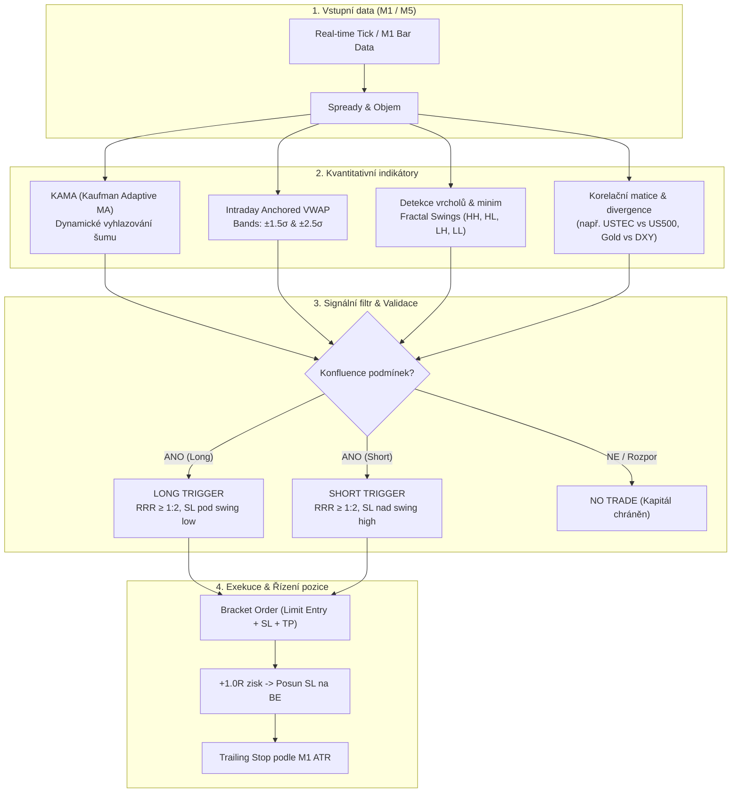

# ⚡ SCALPING ENGINE • ARCHITEKTURA & STRATEGICKÝ PLÁN
## Ultra-krátkodobé intraday spekulace (M1–M15) na nízkonákladových pákových aktivech

> **Status:** Návrh k autorizaci investorem  
> **Autor:** Senior Quantitative & Derivatives Trader (SuggestInvest)  
> **Verze:** 1.0.0 (Říjen 2026)  
> **Cílové časové rámce:** 1 minuta (M1), 3 minuty (M3), 5 minut (M5), 15 minut (M15)  
> **Exekuční směr:** Obousměrný (LONG i SHORT)

---

## 1. Exekutivní shrnutí a filozofie strategie

Tento podprojekt rozšiřuje stávající střednědobý swingový systém SuggestInvest o **autonomní vysokorychlostní intraday modul (Scalping Engine)**. 

Zatímco hlavní systém analyzuje denní bázi (D1) a drží pozice dny až týdny, **Scalping Engine** cílí na intraday mikrovlny, které trvají od **1 minuty do několika desítek minut**.

### Klíčové pilíře:
1. **Eliminace nákladů na spread a komise:**  
   V intraday obchodování je nákladovost rozhodujícím faktorem mezi ziskem a ztrátou. Model operuje výhradně na titulech, kde transakční náklady tvoří méně než **8–12 % průměrného 5minutového rozpětí (ATR)**.
2. **Adaptivní / Floating klouzavé průměry (KAMA, VWAP Bands):**  
   Běžné klouzavé průměry (SMA, EMA) v minutových grafech trpí zpožděním a falešnými signály při konsolidaci. Využijeme **Kaufman Adaptive Moving Average (KAMA)** a **Intraday Anchored VWAP s plovoucími směrodatnými odchylkami (±1.5σ, ±2.5σ)**.
3. **Kvantitativní detekce swingových extrémů (Peaks & Troughs):**  
   Algoritmická identifikace lokálních vrcholů a minim pro přesné časování vstupů a dynamické umísťování Stop-Lossu za strukturální zlomy.
4. **Mezitržní korelace a relativní síla (Lead-Lag Divergence):**  
   Srovnání korelujících aktiv (např. *Nasdaq vs. S&P 500*, *Gold vs. US Dollar Index*, *EUR/USD vs. USD/CHF*) pro odhalení skrytých divergencí ještě předtím, než se projeví na ceně samotného instrumentu.
5. **Přísný asymetrický Risk Management (RRR ≥ 1:2):**  
   Riziko na obchod limitováno na 0.5–1.0 % celkového vyhrazeného kapitálu. Okamžitý posun na Break-Even (BE) a trailing stop podle minutového ATR.

---

## 2. Výběr instrumentů: Ultra-nízké spready & nulové/minimální poplatky

Pro minutový scalping jsou nevhodné běžné akcie s širokým spreadem a fixní komisí za pokyn. Engine se soustředí na **3 kategorie nejlikvidnějších světových pákových aktiv**:

```
+---------------------------------------------------------------------------------------------------------+
|                                    KATEGORIE INTRADAY PÁKOVÝCH AKTIV                                    |
+-------------------------------------+-----------------------------------+-------------------------------+
|  1. INDEXOVÉ DERIVÁTY (CFD/FUTURES) |     2. FOREX MAJORS (RAW SPREAD)  |     3. ULTRA-LIQUID PÁKOVÁ ETF|
|  • US500 / MES (S&P 500)            |     • EUR/USD (Euro / Dollar)     |     • TQQQ / SQQQ (3x QQQ)    |
|  • USTEC / MNQ (Nasdaq 100)         |     • GBP/USD (Cable)             |     • UPRO / SPXU (3x SPY)    |
|  • DE40 (DAX 40 - dopoledne)        |     • USD/JPY (Dollar / Yen)      |     • NVDL (2x Long NVDA)     |
|  • XAU/USD (Zlato / Gold)           |     • AUD/USD (Aussie)            |     • SOXL / SOXS (3x Semis)  |
+-------------------------------------+-----------------------------------+-------------------------------+
```

### Detailní specifikace vybraných instrumentů:

| Ticker | Instrument | Typická páka | Průměrný Spread | Průměrné M5 ATR | Poměr Spread / ATR | Optimální obchodní seance |
| :--- | :--- | :---: | :---: | :---: | :---: | :---: |
| **US500** | S&P 500 Index CFD / MES | 1:20 (CFD) / 1:50 | 0.4–0.5 b. | 6.5–12.0 b. | **~4.5 % (Vynikající)** | 15:30–22:00 CET (US) |
| **USTEC** | Nasdaq 100 CFD / MNQ | 1:20 (CFD) / 1:50 | 1.0–1.4 b. | 35.0–75.0 b. | **~2.8 % (Špičkové)** | 15:30–22:00 CET (US) |
| **DE40** | DAX 40 Index CFD | 1:20 (CFD) | 1.0–1.2 b. | 18.0–40.0 b. | **~4.0 % (Vynikající)** | 09:00–12:30 CET (EU) |
| **EUR/USD**| Forex Major | 1:30 (CFD) / 1:100 | 0.1–0.6 pipu | 8.0–16.0 pips | **~3.5 % (Špičkové)** | 09:00–18:00 CET (EU/US) |
| **GBP/USD**| Forex Major | 1:30 (CFD) | 0.6–1.0 pipu | 14.0–28.0 pips | **~4.2 % (Vynikající)** | 09:00–17:30 CET (Londýn/NY) |
| **GOLD (XAU)** | Zlato vs USD CFD | 1:20 (CFD) | 0.20–0.35 $ | 3.5–7.0 $ | **~5.0 % (Velmi dobré)** | 14:00–20:00 CET (Overlap) |
| **TQQQ / SQQQ**| 3x Pákové Nasdaq ETF | 1:1 (hotovost/margin) | 0.01–0.02 $ | 0.40–1.20 $ | **~2.0 % (0% komise XTB/IBKR)** | 15:30–21:30 CET (US) |

> [!TIP]
> **Proč právě tato aktiva?**  
> Pokud je poměr *Spread / ATR* pod 6 %, náklad na vstup a výstup vás neznevýhodňuje a strategie dosahuje matematického pozitivního očekávání (Positive Expectancy).

---

## 3. Matematický a technický aparát strategie



### A. Floating Moving Averages: KAMA (Kaufman Adaptive Moving Average)
KAMA automaticky přizpůsobuje svou periodu aktuálnímu charakteru trhu pomocí **Efficiency Ratio ($ER$)**:

$$ER_t = \frac{|Price_t - Price_{t-n}|}{\sum_{i=1}^{n} |Price_{i} - Price_{i-1}|}$$

- **V prudkém trendu ($ER \to 1$):** KAMA zrychluje na ekvivalent rychlé EMA(2) – umožní bleskový vstup do rozjetého trendu.
- **V bočním šumu ($ER \to 0$):** KAMA zpomaluje na ekvivalent pomalé EMA(30+) – zabrání whipsaw ztrátám v zóně konsolidace.

### B. Intraday Anchored VWAP & Volatility Bands
Kotvený od začátku denní obchodní seance (09:00 CET pro Evropu, 15:30 CET pro USA):
- **Středová linie (VWAP):** Férová institucionální hodnota dne.
- **Horní pásmo (+2.0σ až +2.5σ):** Překoupená zóna – vyhledávání obratu do **SHORT** (Mean Reversion) nebo prudkého breakoutu.
- **Dolní pásmo (-2.0σ až -2.5σ):** Přeprodaná zóna – vyhledávání obratu do **LONG**.

### C. Detekce vrcholů a zlomů (Swing Extremes)
- Identifikace lokálních **Higher Highs (HH)** a **Higher Lows (HL)** pro Longy.
- Identifikace lokálních **Lower Highs (LH)** a **Lower Lows (LL)** pro Shorty.
- Okamžité určení strukturální neplatnosti (Invalidation Level) = přesné umístění Stop-Lossu.

### D. Korelační a Lead-Lag divergence (Pairs Engine)
Využití mezitržních vztahů s vysokou statistickou korelací:
1. **USTEC vs. US500 (Beta divergence):**  
   Pokud Nasdaq (USTEC) proráží své 15minutové maximum, ale S&P 500 (US500) zaostává, USTEC táhne trh. Pokud ale USTEC vytvoří Higher High a US500 selže (Lower High), jde o medvědí divergenci signalizující falešný průraz.
2. **GOLD vs. DXY (Inverzní korelace):**  
   Zlato a americký dolar mají zápornou korelaci (-0.85). Náhlé oslabení DXY na minutovém grafu je předstihovým impulsem pro nákup zlata (XAU/USD).
3. **EUR/USD vs. GBP/USD (Měnová relativní síla):**  
   Při impulsu na dolaru sledujeme, která měna je slabší (vhodná pro short) a která odolnější (vhodná pro long).

---

## 4. Přesná pravidla obchodních setupů

### Setup 1: "Adaptive Trend Scalp" (M1 / M5 Momentum)
* **Kdy obchodovat:** Během nejaktivnějších hodin (09:00–11:30 CET nebo 15:30–18:00 CET).
* **Podmínka LONG:**
  1. Cena je nad denním VWAP.
  2. KAMA má stoupající sklon ($ER > 0.40$).
  3. Cena provede pullback k pásmu KAMA / EMA-21 a vytvoří reverzní svíčku (hammer, bullish engulfing).
  4. Stop-Loss: 1.5 pipu / bodu pod poslední swingové minimum.
  5. Take-Profit: RRR 1:2.0 nebo horní VWAP pásmo (+2.0σ).
* **Podmínka SHORT:** Zrcadlově obráceně (pod VWAP, klesající KAMA, pullback zdola, SL nad swing high).

### Setup 2: "VWAP Band Reversal" (M1 / M3 Mean-Reversion)
* **Kdy obchodovat:** V obdobích bez velkých makroekonomických zpráv (CPI, FOMC, NFP).
* **Podmínka:**
  1. Cena se dotkne nebo přestřelí vnější pásmo VWAP (±2.5σ).
  2. RSI(7) v pásmu extrémního přeprodání (< 15) nebo překoupení (> 85).
  3. Vznikne svíčková divergence na minutovém grafu.
  4. Cíl: Návrat ke středovému VWAP (RRR typicky 1:2.5 až 1:4).

---

## 5. Risk Management & Ochrana kapitálu

> [!IMPORTANT]
> **Základní pravidlo:** Žádný obchod nesmí být zadán bez předem definovaného Stop-Lossu a Take-Profitu přímo v exekučním příkazu (Bracket Order).

1. **Riziko na jeden obchod:** Maximálně **0.75 %** kapitálu.
2. **Break-Even posun:** Jakmile pozice dosáhne zisku **+1.0R**, Stop-Loss je automaticky posunut na vstupní cenu + spread.
3. **Denní limit ztráty (Max Daily Drawdown):** **-2.5 %** kapitálu. Při jeho dosažení se engine okamžitě přepne do pasivního režimu a ten den již neobchoduje.
4. **Zákaz obchodování před klíčovým makrem (High-Impact News Filter):** 3 minuty před a 3 minuty po vyhlášení US CPI, NFP a rozhodnutí FEDu (FOMC) jsou nové vstupy blokovány kvůli rozšířeným spreadům.

---

## 6. Harmonogram implementace krok za krokem

Před samotným spuštěním ostrého tradingu navrhuji následující postup:

```
[KROK 1] Schválení strategie a instrumentů (tento dokument)
    │
    ▼
[KROK 2] Vytvoření modulu instrumentů (scalping_engine/instruments.py)
    │     - Definice tick velikostí, spreadů, margin požadavků a korelací
    ▼
[KROK 3] Výpočetní engine indikátorů (scalping_engine/indicators.py)
    │     - Implementace KAMA, Intraday VWAP Bands, Swing Detektoru
    ▼
[KROK 4] Signální generátor & Mezitržní korelace (scalping_engine/signals.py)
    │     - Vyhodnocování konfluence M1/M5 a generování signálů
    ▼
[KROK 5] Backtest & Simulace na historických tickových datech
    │     - Ověření win-rate, profit faktoru a maximálního drawdownu
    ▼
[KROK 6] Napojení na Paper Trading (IB Gateway / XTB Demo)
    │     - Živý test bez reálného rizika v reálném čase se zpožděním nula
    ▼
[KROK 7] Vizuální Intraday Dashboard (scalping_engine/dashboard.html)
```

---

*Tento dokument slouží jako základní stavební kámen podprojektu. Po schválení investorem přejdeme k exekuci KROKU 2 a 3.*
